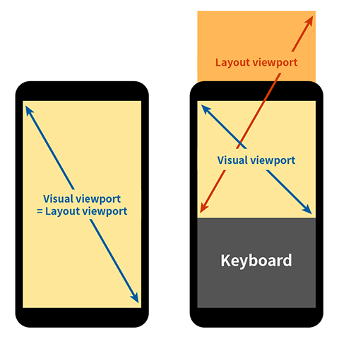

# HTML 문서구조와 메타데이터

Date: 2026년 1월 5일
강의 넘버: 28~30
완료: Yes
1일 후: 핵심요약+문제: No
7일 후:퀴즈+문제: No

# HTML 문서 구조와 메타데이터 완벽 가이드

## 📚 학습 목표

- HTML 문서의 기본 구조와 DOCTYPE 선언의 역할 이해
- head 태그 내 메타데이터의 종류와 활용법 습득
- 웹 접근성을 고려한 시맨틱 태그 사용법 학습

---

## 1. DOCTYPE 선언

### 1.1 DOCTYPE의 개념과 역할

- **DOCTYPE(Document Type Declaration)**은 HTML 문서가 어떤 형식과 버전으로 작성되었는지를 브라우저에게 알려주는 선언문입니다.

**주요 기능:**

- 문서의 형식과 버전 명시
- 브라우저의 렌더링 모드 결정

### 1.2 렌더링 모드의 종류

**Standards Mode (표준 모드)**

- DOCTYPE을 선언했을 때 실행되는 모드
- 최신 웹 표준에 따라 페이지를 렌더링
- 일관된 레이아웃과 동작 보장

**Quirks Mode (호환 모드)**

- DOCTYPE을 선언하지 않았을 때 실행되는 모드
- 익스플로러 5, 넷스케이프 4 등 오래된 브라우저를 모방
- 예측 불가능한 레이아웃 문제 발생 가능

### 1.3 DOCTYPE 문법

```html
<!-- HTML5 (현재 표준) -->
<!DOCTYPE html>

<!-- HTML 4.01 Strict -->
<!DOCTYPE HTML PUBLIC "-//W3C//DTD HTML 4.01//EN" "http://www.w3.org/TR/html4/strict.dtd">

<!-- HTML 4.01 Transitional -->
<!DOCTYPE HTML PUBLIC "-//W3C//DTD HTML 4.01 Transitional//EN" "http://www.w3.org/TR/html4/loose.dtd">

<!-- HTML 4.01 Frameset -->
<!DOCTYPE HTML PUBLIC "-//W3C//DTD HTML 4.01 Frameset//EN" "http://www.w3.org/TR/html4/frameset.dtd">

```

**사용 상황:**

- 모든 HTML 문서의 최상단에 위치
- HTML5에서는 `<!DOCTYPE html>` 형태로 간소화됨
- 대소문자 구분 없음 (관례적으로 대문자 사용)

---

## 2. head 태그와 메타데이터

### 2.1 head 태그의 개념

**head 태그**는 문서의 메타데이터(기계가 읽을 정보)를 담는 컨테이너입니다.

**포함 가능한 요소:**

- 페이지의 제목 (title)
- 파비콘 (favicon)
- 문자 인코딩 정보
- 뷰포트 설정
- Open Graph 정보
- CSS 및 JavaScript 링크

```html
<head>
  <meta charset="UTF-8">
  <meta name="viewport" content="width=device-width, initial-scale=1.0">
  <title>페이지 제목</title>
  <link rel="stylesheet" href="style.css">
</head>

```

### 2.2 title 태그

**title 태그**는 웹페이지의 제목을 정의합니다.

```html
<title>HTML & CSS</title>

```

**표시 위치:**

- 브라우저 탭에 표시
- 브라우저 즐겨찾기의 제목
- 검색엔진 검색결과의 제목

**사용 상황:**

- 모든 HTML 문서에 필수적으로 포함
- SEO(검색엔진 최적화)에 중요한 역할
- 명확하고 설명적인 제목 작성 권장

---

## 3. meta 태그와 속성

### 3.1 charset 속성 (문자 인코딩)

**charset 속성**은 페이지가 어떤 문자 인코딩으로 작성되었는지 명시합니다.

```html
<!-- HTML5 형식 (권장) -->
<meta charset="UTF-8">

<!-- 과거 형식 -->
<meta http-equiv="content-type" content="text/html; charset=UTF-8">

```

**UTF-8의 특징:**

- 전세계 거의 모든 문자를 표현 가능한 유니코드 인코딩
- 한글, 영어, 중국어, 일본어 등 다국어 지원
- 이모지 등 특수 문자도 표현 가능

**주의사항:**

- 문서 저장 형식도 UTF-8로 맞춰야 함
- 인코딩 불일치 시 글자가 깨져 보임
- html 태그의 lang 속성(언어)과는 다른 개념

### 3.2 IE 호환성 설정

```html
<meta http-equiv="X-UA-Compatible" content="IE=edge">

```

**설정값:**

- `IE=edge`: 해당 IE 버전에서 가장 최신 모드로 실행
- `IE=7`, `IE=8`, `IE=9`: 특정 버전 모드로 실행

**사용 상황:**

- 과거 인터넷 익스플로러 호환성을 위해 사용
- 현재는 거의 사용되지 않음 (IE 지원 종료)

### 3.3 viewport 설정 (모바일 대응)

```html
<meta name="viewport" content="width=device-width, initial-scale=1.0">

```

**viewport의 개념:**

- **시각적 뷰포트**: 사용자에게 실제로 보이는 영역
- **레이아웃 뷰포트**: 브라우저가 웹페이지를 그리는 영역



**content 속성의 항목들:**

| 항목 | 설명 | 비고 |
| --- | --- | --- |
| width | 뷰포트의 너비 | device-width: 기기 화면 너비, 정수: 픽셀 단위 |
| initial-scale | 페이지 로드 시 줌 레벨 | 기본값: 1.0 |
| maximum-scale | 최대 줌 레벨 | 사용 비추천 (접근성 저해) |
| minimum-scale | 최소 줌 레벨 | 사용 비추천 (접근성 저해) |
| user-scalable | 핀치 줌 가능 여부 | no로 비활성화 시 접근성 저해 |

**사용 예시:**

```html
<!-- 반응형 웹 기본 설정 -->
<meta name="viewport" content="width=device-width, initial-scale=1.0">

<!-- 줌 제한 (비추천) -->
<meta name="viewport" content="width=device-width, initial-scale=1.0, maximum-scale=1.0, user-scalable=no">

<!-- 특정 너비 지정 -->
<meta name="viewport" content="width=500, initial-scale=1.0">

```

**사용 상황:**

- 모바일 기기에서의 적절한 화면 표시를 위해 필수
- 반응형 웹 디자인 구현 시 필수 요소
- maximum-scale, minimum-scale, user-scalable=no는 접근성을 해치므로 사용 지양

### 3.4 Open Graph 메타데이터

**Open Graph**는 Meta(구 Facebook)에서 만든 소셜 미디어 공유를 위한 프로토콜입니다.

```html
<meta property="og:title" content="얄코의 HTML & CSS 강좌">
<meta property="og:description" content="얄코의 최신 강좌! 웹 개발을 위한 HTML과 CSS 지식들을 '떠먹여'드립니다.">
<meta property="og:image" content="https://showcases.yalco.kr/html-css-scoop/03-01/yalco.png">

```

**주요 속성:**

- `og:title`: 공유될 때 표시되는 제목
- `og:description`: 공유될 때 표시되는 설명
- `og:image`: 공유될 때 표시되는 이미지 URL
- `og:url`: 콘텐츠의 정식 URL
- `og:type`: 콘텐츠 타입 (website, article 등)

**사용 상황:**

- 페이스북, 카카오톡, 트위터 등에 링크 공유 시
- 소셜 미디어에서 보기 좋은 미리보기 제공
- 클릭률 향상에 도움

---

## 4. 파비콘 (Favicon)

**파비콘**은 브라우저 탭, 즐겨찾기, 주소창 등에 표시되는 작은 아이콘입니다.

```html
<link rel="shortcut icon" href="./favicon.png" type="image/x-icon">

```

**지원 파일 형식:**

- `.png` (권장)
- `.gif`
- `.ico` (과거 IE 호환성)
- `.svg`

**사용 상황:**

- 브랜드 아이덴티티 표현
- 여러 탭 중 페이지 식별 용이
- 전문적인 웹사이트 인상 제공

**파비콘 제작 팁:**

- 16x16, 32x32, 48x48 픽셀 크기 권장
- 단순하고 식별 가능한 디자인
- 'favicon generator' 검색으로 변환 도구 활용

---

## 5. 웹 접근성 (Web Accessibility)

### 5.1 웹 접근성의 개념

**웹 접근성**이란 장애인, 고령자 등 모든 사용자가 웹사이트를 이용할 수 있도록 보장하는 것입니다.

**주요 사용자:**

- 시각 장애인 (스크린 리더 사용)
- 청각 장애인
- 운동 장애인
- 인지 장애인

### 5.2 이미지 대체 텍스트 (alt 속성)

**alt 속성**은 이미지를 볼 수 없는 상황에서 대체 텍스트를 제공합니다.

```html
<!-- 의미 있는 이미지 -->


<!-- 장식용 이미지 -->

장바구니에 담기

```

**사용 상황:**

- **의미 있는 이미지**: 구체적인 설명 작성
- **장식용 이미지**: 빈 문자열(`alt=""`) 사용
- alt 미작성 시 스크린 리더가 파일명을 읽음

### 5.3 화면에서 숨기되 스크린 리더로 읽히는 텍스트

```html
<span class="sr-only">디자이너</span>

```

```css
.sr-only {
  position: absolute;
  width: 1px;
  height: 1px;
  padding: 0;
  margin: -1px;
  overflow: hidden;
  clip: rect(0, 0, 0, 0);
  white-space: nowrap;
  border-width: 0;
}

```

**사용 상황:**

- 시각적으로는 불필요하지만 맥락 이해에 필요한 정보
- 아이콘 버튼의 설명
- 페이지 구조 정보

### 5.4 aria-label 속성

**aria-label**은 요소에 접근 가능한 이름을 제공합니다.

```html
<button aria-label="이전 페이지로 이동">◀</button>
<button aria-label="1페이지로 이동">1</button>
<button aria-label="다음 페이지로 이동">▶</button>

```

**사용 상황:**

- 아이콘만 있는 버튼
- 기호나 화살표 등 의미 전달이 어려운 요소
- 텍스트 라벨이 없는 폼 컨트롤

### 5.5 aria-hidden과 role 속성

```html
<!-- 장식용 이모지 숨기기 -->
<span aria-hidden="true">😀</span> 반갑습니다!

<!-- 의미 있는 이모지에 설명 추가 -->
<span role="img" aria-label="하트">❤️</span>

```

**aria-hidden="true":**

- 스크린 리더에서 완전히 숨김
- 장식용 이모지, SVG 요소에 사용

**role="img"와 aria-label 조합:**

- 이모지나 SVG를 이미지로 인식시킴
- aria-label로 읽을 텍스트 제공
- 의미 전달이 필요한 시각 요소에 사용

### 5.6 figure와 figcaption 태그

```html
<figure>
  
  <figcaption>
    노트북으로 뭔가 공부하고 있는 아이의 독백:
    코딩을 배우면 아마 굶지는 않을거랬어.
  </figcaption>
</figure>

```

**사용 상황:**

- 이미지에 긴 설명이 필요한 경우
- 차트, 다이어그램 등 복잡한 시각 자료
- 코드 스니펫, 인용문 등
- 아스키 아트

**장점:**

- 이미지와 설명의 명확한 연결
- 스크린 리더에서 적절히 읽힘
- 의미론적으로 올바른 구조

---

## 6. 시맨틱 태그 (Semantic Tags)

### 6.1 시맨틱 태그의 개념

**시맨틱 태그**는 태그 자체가 의미를 가지는 HTML5 요소입니다.

**특징:**

- 기능적으로는 div와 동일
- 태그 이름이 요소의 역할과 의미를 나타냄
- 페이지 구조를 명확하게 표현

### 6.2 시맨틱 태그의 유용성

**1. 웹 접근성 개선**

- 스크린 리더 사용자가 페이지 구조 파악 용이
- 필요한 정보로 빠르게 이동 가능

**2. SEO (검색엔진 최적화)**

- 검색엔진이 각 정보의 종류를 정확히 파악
- 페이지 순위 결정에 긍정적 영향

**3. 유지보수와 가독성**

- 코드 구조 파악이 쉬움
- 협업 시 의사소통 원활
- 수정 및 관리 효율 증대

### 6.3 주요 시맨틱 태그

### header

```html
<header>
  <h1>웹사이트 로고</h1>
  <nav>
    <ul>
      <li><a href="#home">홈</a></li>
      <li><a href="#about">소개</a></li>
    </ul>
  </nav>
</header>

```

**역할:**

- 페이지나 구획의 제목 역할
- 로고, 제목, 검색창, 주요 네비게이션 포함

**사용 상황:**

- 페이지 최상단
- article이나 section의 헤더
- 페이지당 여러 개 사용 가능

### nav

```html
<nav>
  <ul>
    <li><a href="#home">홈</a></li>
    <li><a href="#products">제품</a></li>
    <li><a href="#contact">연락처</a></li>
  </ul>
</nav>

```

**역할:**

- 링크들을 포함하는 네비게이션 영역
- 주요 메뉴나 색인 등

**사용 상황:**

- 주 메뉴 (헤더 내)
- 사이드바 메뉴
- 푸터 링크
- 페이지 내 목차

**주의사항:**

- 모든 링크 그룹이 nav일 필요는 없음
- 주요 네비게이션에만 사용

### footer

```html
<footer>
  <p>&copy; 2024 회사명. All rights reserved.</p>
  <address>
    <p>연락처: contact@example.com</p>
    <p>주소: 서울시 강남구</p>
  </address>
</footer>

```

**역할:**

- 페이지나 구획의 최하단 영역
- 저작권, 연락처, 관련 링크 등

**사용 상황:**

- 페이지 하단
- article이나 section의 푸터
- 페이지당 여러 개 사용 가능

### main

```html
<main>
  <article>
    <h1>주요 콘텐츠 제목</h1>
    <p>페이지의 핵심 내용...</p>
  </article>
</main>

```

**역할:**

- 페이지의 주요 콘텐츠 영역
- 문서의 핵심 주제와 직접 관련된 내용

**사용 상황:**

- 페이지의 중심 콘텐츠
- **페이지당 단 하나만 존재해야 함**
- header, footer, nav, aside 외부에 위치

### aside

```html
<aside>
  <h3>관련 링크</h3>
  <ul>
    <li><a href="#">참고 자료 1</a></li>
    <li><a href="#">참고 자료 2</a></li>
  </ul>
</aside>

```

**역할:**

- 사이드바 등 주요 내용과 간접적으로 관련된 콘텐츠
- 부가 정보, 광고, 관련 링크 등

**사용 상황:**

- 사이드바
- 콜아웃 박스
- 광고 영역
- 관련 콘텐츠 추천

### section

```html
<section>
  <h2>섹션 제목</h2>
  <p>이 섹션의 내용...</p>
</section>

```

**역할:**

- 페이지를 주제별 구획으로 나눔
- 제목을 가진 콘텐츠 그룹

**사용 상황:**

- 챕터, 탭 패널
- 주제별로 구분된 콘텐츠
- 일반적으로 제목(h1-h6) 포함

**주의사항:**

- 단순 스타일링 목적이면 div 사용
- 의미 있는 구획 구분에만 사용

### article

```html
<article>
  <h2>블로그 포스트 제목</h2>
  <p>포스트 작성일: 2024-01-05</p>
  <p>포스트 내용...</p>
</article>

```

**역할:**

- 독립적이고 재사용 가능한 콘텐츠
- 다른 페이지에서도 의미가 통하는 콘텐츠

**사용 상황:**

- 블로그 포스트
- 뉴스 기사
- 포럼 게시글
- 댓글
- 위젯

**판단 기준:**

- RSS 피드에 포함될 수 있는가?
- 다른 사이트에 그대로 옮겨도 의미가 통하는가?

### 6.4 시맨틱 태그 종합 예제

```html
<!DOCTYPE html>
<html lang="ko">
<head>
  <meta charset="UTF-8">
  <meta name="viewport" content="width=device-width, initial-scale=1.0">
  <title>시맨틱 태그 예제</title>
</head>
<body>
  <header>
    <h1>웹사이트 로고</h1>
    <nav>
      <ul>
        <li><a href="#home">홈</a></li>
        <li><a href="#about">소개</a></li>
        <li><a href="#contact">연락처</a></li>
      </ul>
    </nav>
  </header>

  <main>
    <section>
      <h2>최신 소식</h2>
      <article>
        <h3>첫 번째 기사</h3>
        <p>기사 내용...</p>
      </article>
      <article>
        <h3>두 번째 기사</h3>
        <p>기사 내용...</p>
      </article>
    </section>

    <section>
      <h2>제품 소개</h2>
      <p>제품 설명...</p>
    </section>
  </main>

  <aside>
    <h3>관련 링크</h3>
    <ul>
      <li><a href="#">링크 1</a></li>
      <li><a href="#">링크 2</a></li>
    </ul>
  </aside>

  <footer>
    <address>
      <p>웹사이트 주소: yalco.kr</p>
      <p>오피스: 전산시 개발구 코딩동 123번길 45</p>
      <p>전화: 010-1234-5678</p>
      <p>이메일: yalco@kakao.com</p>
    </address>
    <p>&copy; 2024 얄코. All rights reserved.</p>
  </footer>
</body>
</html>

```

---

## 📝 최종 핵심 요약

### DOCTYPE과 문서 구조

- `<!DOCTYPE html>` 선언으로 표준 모드 렌더링 보장
- head 태그에는 메타데이터, body 태그에는 실제 콘텐츠 배치

### 필수 메타 태그

- `charset="UTF-8"`: 문자 인코딩 설정, 글자 깨짐 방지
- `viewport`: 모바일 반응형 웹 구현 필수 요소
- Open Graph: 소셜 미디어 공유 최적화

### 웹 접근성 핵심 원칙

- 모든 의미 있는 이미지에 alt 속성 작성
- 장식용 이미지는 `alt=""` 사용
- aria-label로 버튼과 링크에 명확한 설명 제공
- aria-hidden으로 장식 요소 숨김

### 시맨틱 태그의 장점

- **웹 접근성**: 스크린 리더 사용자의 페이지 탐색 개선
- **SEO**: 검색엔진의 콘텐츠 이해도 향상
- **유지보수**: 코드 가독성과 구조 파악 용이

### 주요 시맨틱 태그 정리

- `<header>`: 로고, 제목, 네비게이션
- `<nav>`: 주요 링크 모음
- `<main>`: 페이지의 핵심 콘텐츠 (페이지당 1개)
- `<article>`: 독립적인 콘텐츠 (기사, 포스트)
- `<section>`: 주제별 구획
- `<aside>`: 부가 정보, 사이드바
- `<footer>`: 저작권, 연락처 정보

---

## 💡 복습 퀴즈

### 퀴즈 1

DOCTYPE 선언의 주요 역할은 무엇인가요?

1. 웹페이지의 제목을 설정한다
2. 문서의 형식과 버전을 명시하고 브라우저의 렌더링 모드를 결정한다
3. 페이지의 문자 인코딩을 설정한다
4. 검색엔진 최적화를 위한 메타데이터를 제공한다

**정답: 2**

해설: DOCTYPE은 HTML 문서가 어떤 형식과 버전으로 작성되었는지를 브라우저에게 알려주며, 이를 통해 표준 모드(standards mode) 또는 호환 모드(quirks mode)로 렌더링할지 결정합니다. DOCTYPE을 선언하면 최신 웹 표준에 따라 페이지가 렌더링되고, 선언하지 않으면 오래된 브라우저를 모방하는 호환 모드로 실행됩니다.

---

### 퀴즈 2

다음 중 UTF-8 charset에 대한 설명으로 옳지 않은 것은?

1. 전세계 거의 모든 문자를 표현할 수 있는 유니코드 인코딩이다
2. 한글, 영어, 중국어, 일본어 등 다국어를 지원한다
3. HTML 문서의 lang 속성과 동일한 개념이다
4. 이모지 등 특수 문자도 표현할 수 있다

**정답: 3**

해설: charset은 문자 인코딩 방식을 지정하는 것이고, lang 속성은 문서의 언어를 지정하는 것으로 서로 다른 개념입니다. charset="UTF-8"은 문자를 컴퓨터가 어떻게 저장하고 표현할지를 정의하는 반면, lang="ko"는 문서가 한국어로 작성되었음을 나타냅니다.

---

### 퀴즈 3

viewport 메타 태그의 `width=device-width` 설정은 무엇을 의미하나요?

1. 페이지의 너비를 고정된 픽셀 값으로 설정한다
2. 뷰포트의 너비를 기기의 화면 너비에 맞춘다
3. 페이지의 최대 너비를 제한한다
4. 브라우저 창의 너비를 자동으로 조절한다

**정답: 2**

해설: `width=device-width`는 레이아웃 뷰포트의 너비를 기기의 화면 너비에 맞추도록 설정합니다. 이는 모바일 기기에서 페이지가 적절한 크기로 표시되도록 하며, 반응형 웹 디자인의 핵심 설정입니다. 이 설정 없이는 모바일 브라우저가 데스크톱 페이지를 축소하여 보여주게 됩니다.

---

### 퀴즈 4

다음 중 웹 접근성을 위한 올바른 이미지 사용법은?

1. 모든 이미지에 상세한 alt 텍스트를 작성한다
2. 의미 있는 이미지에는 alt 속성을, 장식용 이미지에는 빈 alt(`alt=""`)를 사용한다
3. alt 속성은 선택사항이므로 필요할 때만 작성한다
4. 장식용 이미지는 alt 속성을 아예 작성하지 않는다

**정답: 2**

해설: 의미 있는 이미지(콘텐츠 전달, 기능 수행)에는 구체적인 alt 텍스트를 작성하여 시각 장애인이 내용을 이해할 수 있도록 해야 합니다. 반면 순수 장식용 이미지는 `alt=""`(빈 문자열)를 사용하여 스크린 리더가 건너뛰도록 합니다. alt 속성을 아예 작성하지 않으면 스크린 리더가 파일명을 읽게 되어 사용자 경험을 해칩니다.

---

### 퀴즈 5

aria-label 속성의 주요 용도는 무엇인가요?

1. 요소를 스크린 리더에서 숨긴다
2. 요소에 접근 가능한 이름을 제공한다
3. 요소의 역할을 정의한다
4. 요소의 시각적 레이블을 변경한다

**정답: 2**

해설: aria-label은 요소에 접근 가능한 이름(accessible name)을 제공하여 스크린 리더가 읽을 수 있는 텍스트를 지정합니다. 특히 아이콘만 있는 버튼, 기호나 화살표로만 표시된 요소처럼 시각적으로는 명확하지만 텍스트 라벨이 없는 경우에 유용합니다. 예를 들어 `<button aria-label="이전 페이지로 이동">◀</button>`처럼 사용합니다.

---

### 퀴즈 6

시맨틱 태그 사용의 장점이 아닌 것은?

1. 웹 접근성이 개선된다
2. 검색엔진 최적화(SEO)에 도움이 된다
3. 페이지 로딩 속도가 빨라진다
4. 코드의 가독성과 유지보수성이 향상된다

**정답: 3**

해설: 시맨틱 태그는 페이지 로딩 속도와는 직접적인 관련이 없습니다. 시맨틱 태그의 주요 장점은 (1) 스크린 리더 사용자의 페이지 구조 파악 개선, (2) 검색엔진이 콘텐츠를 더 정확히 이해하여 SEO 향상, (3) 개발자가 코드 구조를 쉽게 파악할 수 있어 유지보수 효율 증대입니다. 성능은 주로 파일 크기, 리소스 최적화, 서버 응답 시간 등에 의해 결정됩니다.

---

### 퀴즈 7

다음 중 `<main>` 태그에 대한 설명으로 옳은 것은?

1. 페이지에 여러 개 사용할 수 있다
2. header와 footer 내부에 위치할 수 있다
3. 페이지의 주요 콘텐츠를 담으며 페이지당 하나만 존재해야 한다
4. 사이드바 콘텐츠를 담는 용도로 사용한다

**정답: 3**

해설: `<main>` 태그는 페이지의 핵심 주제와 직접 관련된 주요 콘텐츠를 담는 영역으로, **페이지당 단 하나만 존재**해야 합니다. main은 header, footer, nav, aside 외부에 위치하며, 문서의 중심 콘텐츠를 명확히 식별하여 스크린 리더 사용자가 주요 내용으로 빠르게 이동할 수 있도록 돕습니다.

---

### 퀴즈 8

`<article>` 태그를 사용하기 적합한 콘텐츠는?

1. 페이지의 헤더 영역
2. 네비게이션 메뉴
3. 블로그 포스트, 뉴스 기사, 댓글
4. 사이드바의 광고 영역

**정답: 3**

해설: `<article>` 태그는 독립적이고 재사용 가능한 콘텐츠에 사용됩니다. 블로그 포스트, 뉴스 기사, 포럼 게시글, 댓글 등이 대표적인 예입니다. 판단 기준은 "RSS 피드에 포함될 수 있는가?", "다른 사이트에 그대로 옮겨도 의미가 통하는가?"입니다. article은 그 자체로 완결된 콘텐츠를 의미합니다.

---

## 🔨 연습문제

### 문제 1: 기본 HTML 문서 구조 작성

**문제:** 다음 요구사항을 만족하는 HTML 문서를 작성하세요.

- HTML5 DOCTYPE 선언
- 한국어 페이지
- UTF-8 인코딩
- 뷰포트 설정으로 모바일 대응
- 제목은 "웹 접근성 실습"
- 파비콘 링크 포함 (favicon.png)

**기본 코드:**

```html
<!-- 여기에 DOCTYPE 선언 -->
<html>
<head>
  <!-- 여기에 메타 태그들과 title 작성 -->
</head>
<body>
  <h1>웹 접근성 실습 페이지</h1>
</body>
</html>

```

**정답:**

```html
<!DOCTYPE html>
<html lang="ko">
<head>
  <meta charset="UTF-8">
  <meta name="viewport" content="width=device-width, initial-scale=1.0">
  <title>웹 접근성 실습</title>
  <link rel="shortcut icon" href="./favicon.png" type="image/x-icon">
</head>
<body>
  <h1>웹 접근성 실습 페이지</h1>
</body>
</html>

```

**해설:**

- `<!DOCTYPE html>`: HTML5 문서임을 선언하여 표준 모드로 렌더링되도록 합니다.
- `lang="ko"`: 문서의 언어가 한국어임을 명시합니다.
- `charset="UTF-8"`: 한글을 포함한 모든 문자를 올바르게 표현할 수 있도록 인코딩을 설정합니다.
- `viewport` 설정: 모바일 기기에서 화면 너비에 맞게 페이지가 표시되도록 합니다.
- 파비콘 링크: 브라우저 탭에 표시될 아이콘을 지정합니다.

---

### 문제 2: Open Graph 메타 태그 추가

**문제:** 다음 정보를 Open Graph 메타 태그로 작성하세요.

- 제목: "프론트엔드 개발 가이드"
- 설명: "HTML, CSS, JavaScript를 배우는 완벽한 가이드"
- 이미지: "https://example.com/images/og-image.jpg"
- URL: "https://example.com/frontend-guide"
- 타입: "website"

**기본 코드:**

```html
<head>
  <meta charset="UTF-8">
  <!-- 여기에 Open Graph 메타 태그 작성 -->
</head>

```

**정답:**

```html
<head>
  <meta charset="UTF-8">
  <meta property="og:title" content="프론트엔드 개발 가이드">
  <meta property="og:description" content="HTML, CSS, JavaScript를 배우는 완벽한 가이드">
  <meta property="og:image" content="https://example.com/images/og-image.jpg">
  <meta property="og:url" content="https://example.com/frontend-guide">
  <meta property="og:type" content="website">
</head>

```

**해설:**

- Open Graph 메타 태그는 `property` 속성을 사용하며 `og:` 접두사로 시작합니다.
- `og:title`: 소셜 미디어에 공유될 때 표시되는 제목
- `og:description`: 링크 미리보기에 표시될 설명
- `og:image`: 썸네일 이미지 URL (절대 경로 사용 권장)
- `og:url`: 콘텐츠의 정식 URL
- `og:type`: 콘텐츠 유형 (website, article, video 등)
- 이 메타 태그들은 페이스북, 카카오톡, 트위터 등에서 링크를 공유할 때 보기 좋은 미리보기를 제공합니다.

---

### 문제 3: 웹 접근성을 고려한 이미지와 버튼 작성

**문제:** 다음 요소들을 웹 접근성을 고려하여 작성하세요.

1. "홈으로 가기" 기능의 집 모양 아이콘 이미지 (home-icon.png)
2. 장식용 별 이미지 (star.png)
3. 화살표(→) 기호만 있는 "다음" 버튼
4. 하트 이모지(❤️)를 사용한 "좋아요" 표시

**기본 코드:**

```html
<div class="navigation">
  <!-- 1. 홈 아이콘 -->
  

  <!-- 2. 장식용 별 이미지 -->
  

  <!-- 3. 다음 버튼 -->
  <button>→</button>

  <!-- 4. 좋아요 표시 -->
  <span>❤️</span> 좋아요
</div>

```

**정답:**

```html
<div class="navigation">
  <!-- 1. 홈 아이콘 -->
  

  <!-- 2. 장식용 별 이미지 -->
  

  <!-- 3. 다음 버튼 -->
  <button aria-label="다음 페이지로 이동">→</button>

  <!-- 4. 좋아요 표시 -->
  <span role="img" aria-label="하트">❤️</span> 좋아요
</div>

```

**해설:**

1. **의미 있는 이미지**: `alt="홈으로 가기"`로 이미지의 기능을 명확히 설명합니다.
2. **장식용 이미지**: `alt=""`(빈 문자열)로 스크린 리더가 건너뛰도록 합니다. alt 속성을 아예 생략하면 파일명을 읽게 됩니다.
3. **아이콘 버튼**: `aria-label`로 버튼의 기능을 설명합니다. 화살표 기호만으로는 의미가 불명확하므로 필수입니다.
4. **의미 있는 이모지**: `role="img"`로 이미지임을 명시하고 `aria-label`로 읽을 텍스트를 제공합니다.

---

### 문제 4: 시맨틱 태그로 페이지 구조화

**문제:** 다음 블로그 페이지 구조를 시맨틱 태그를 사용하여 작성하세요.

- 페이지 제목: "개발 블로그"
- 네비게이션: 홈, 포스트, 소개, 연락처
- 주요 콘텐츠:
    - 최신 포스트 섹션
        - 포스트 1: "JavaScript 기초"
        - 포스트 2: "CSS Grid 완벽 가이드"
    - 인기 포스트 섹션
        - 포스트 3: "React 시작하기"
- 사이드바: 카테고리 목록
- 푸터: 저작권 정보 "© 2024 개발 블로그"

**기본 코드:**

```html
<!DOCTYPE html>
<html lang="ko">
<head>
  <meta charset="UTF-8">
  <title>개발 블로그</title>
</head>
<body>
  <!-- 여기에 시맨틱 태그를 사용하여 구조 작성 -->
</body>
</html>

```

**정답:**

```html
<!DOCTYPE html>
<html lang="ko">
<head>
  <meta charset="UTF-8">
  <meta name="viewport" content="width=device-width, initial-scale=1.0">
  <title>개발 블로그</title>
</head>
<body>
  <header>
    <h1>개발 블로그</h1>
    <nav>
      <ul>
        <li><a href="#home">홈</a></li>
        <li><a href="#posts">포스트</a></li>
        <li><a href="#about">소개</a></li>
        <li><a href="#contact">연락처</a></li>
      </ul>
    </nav>
  </header>

  <main>
    <section>
      <h2>최신 포스트</h2>
      <article>
        <h3>JavaScript 기초</h3>
        <p>JavaScript의 기본 문법과 개념을 배워봅시다...</p>
      </article>
      <article>
        <h3>CSS Grid 완벽 가이드</h3>
        <p>CSS Grid로 복잡한 레이아웃을 쉽게 만드는 방법...</p>
      </article>
    </section>

    <section>
      <h2>인기 포스트</h2>
      <article>
        <h3>React 시작하기</h3>
        <p>React를 처음 배우는 분들을 위한 입문 가이드...</p>
      </article>
    </section>
  </main>

  <aside>
    <h3>카테고리</h3>
    <ul>
      <li><a href="#javascript">JavaScript</a></li>
      <li><a href="#css">CSS</a></li>
      <li><a href="#react">React</a></li>
    </ul>
  </aside>

  <footer>
    <p>&copy; 2024 개발 블로그</p>
  </footer>
</body>
</html>

```

**해설:**

- `<header>`: 페이지 제목과 주 네비게이션을 포함합니다.
- `<nav>`: 주요 메뉴 링크들을 그룹화합니다.
- `<main>`: 페이지의 핵심 콘텐츠를 담으며, 페이지당 하나만 존재합니다.
- `<section>`: "최신 포스트"와 "인기 포스트"라는 주제별 구획을 나눕니다. 각 섹션에는 제목(h2)이 있어야 합니다.
- `<article>`: 각 블로그 포스트는 독립적인 콘텐츠이므로 article 태그를 사용합니다. RSS 피드에 포함되거나 다른 페이지로 이동해도 의미가 통합니다.
- `<aside>`: 사이드바의 카테고리 목록처럼 주요 콘텐츠와 간접적으로 관련된 내용을 담습니다.
- `<footer>`: 저작권 정보 등 페이지 하단 정보를 포함합니다.

---

### 문제 5: 복합 접근성 기능 구현

**문제:** 다음 페이지네이션 컴포넌트를 웹 접근성을 고려하여 완성하세요.

- 이전 페이지 버튼 (◀)
- 페이지 번호 1, 2, 3 (현재 2페이지)
- 다음 페이지 버튼 (▶)
- 장식용 구분선 이미지 (divider.png)
- 현재 페이지는 시각적으로만 볼드 처리, 스크린 리더에는 "현재 페이지" 정보 제공

**기본 코드:**

```html
<style>
  .pagination { display: flex; gap: 10px; align-items: center; }
  .current { font-weight: bold; }
  .sr-only {
    position: absolute;
    width: 1px;
    height: 1px;
    padding: 0;
    margin: -1px;
    overflow: hidden;
    clip: rect(0, 0, 0, 0);
    white-space: nowrap;
    border-width: 0;
  }
</style>

<nav class="pagination">
  <!-- 여기에 접근성을 고려한 페이지네이션 작성 -->
</nav>

```

**정답:**

```html
<style>
  .pagination { display: flex; gap: 10px; align-items: center; }
  .current { font-weight: bold; }
  .sr-only {
    position: absolute;
    width: 1px;
    height: 1px;
    padding: 0;
    margin: -1px;
    overflow: hidden;
    clip: rect(0, 0, 0, 0);
    white-space: nowrap;
    border-width: 0;
  }
</style>

<nav class="pagination" aria-label="페이지네이션">
  <button aria-label="이전 페이지로 이동">◀</button>

  <button aria-label="1페이지로 이동">1</button>

  <button class="current" aria-label="2페이지" aria-current="page">
    2
    <span class="sr-only">(현재 페이지)</span>
  </button>

  <button aria-label="3페이지로 이동">3</button>

  

  <button aria-label="다음 페이지로 이동">▶</button>
</nav>

```

**해설:**

1. **nav 태그에 aria-label**: 여러 네비게이션이 있을 수 있으므로 "페이지네이션"임을 명시합니다.
2. **화살표 버튼**: `aria-label`로 기능을 명확히 설명합니다.
3. **페이지 번호 버튼**: 각 버튼에 "X페이지로 이동"이라는 설명을 제공합니다.
4. **현재 페이지**:
    - `aria-current="page"`로 현재 페이지임을 명시
    - `.sr-only` 클래스로 시각적으로는 숨기되 스크린 리더에게만 "(현재 페이지)" 정보 제공
5. **장식용 이미지**: `alt=""`로 스크린 리더가 건너뛰도록 합니다.
6. 이 구조는 키보드 네비게이션과 스크린 리더 모두에서 원활하게 작동합니다.

---

## ✅ 학습 체크리스트

### 기본 개념

- [ ]  DOCTYPE 선언의 역할과 표준 모드/호환 모드의 차이를 이해했다
- [ ]  head 태그의 역할과 메타데이터의 개념을 설명할 수 있다
- [ ]  title 태그가 표시되는 위치들을 알고 있다

### 메타 태그

- [ ]  UTF-8 charset의 중요성과 lang 속성과의 차이를 이해했다
- [ ]  viewport 메타 태그의 각 속성(width, initial-scale 등)을 이해했다
- [ ]  viewport 설정이 모바일 반응형 웹에 필수적인 이유를 알고 있다
- [ ]  Open Graph 메타 태그의 주요 속성들을 작성할 수 있다
- [ ]  파비콘을 추가하는 방법을 알고 있다

### 웹 접근성

- [ ]  의미 있는 이미지와 장식용 이미지에 alt 속성을 다르게 적용할 수 있다
- [ ]  .sr-only 클래스를 사용하여 스크린 리더 전용 텍스트를 작성할 수 있다
- [ ]  aria-label 속성을 활용하여 버튼과 링크에 설명을 추가할 수 있다
- [ ]  aria-hidden과 role 속성의 차이와 사용법을 이해했다
- [ ]  figure와 figcaption 태그의 용도를 알고 있다

### 시맨틱 태그

- [ ]  시맨틱 태그의 세 가지 주요 장점을 설명할 수 있다
- [ ]  header, nav, footer 태그를 적절히 사용할 수 있다
- [ ]  main 태그가 페이지당 하나만 존재해야 하는 이유를 알고 있다
- [ ]  section과 article의 차이를 이해하고 구분하여 사용할 수 있다
- [ ]  aside 태그의 용도를 알고 적절한 상황에 사용할 수 있다
- [ ]  div 대신 시맨틱 태그를 사용해야 하는 경우를 판단할 수 있다

### 실전 응용

- [ ]  완전한 HTML5 문서 구조를 처음부터 작성할 수 있다
- [ ]  웹 접근성을 고려한 이미지와 버튼을 작성할 수 있다
- [ ]  시맨틱 태그를 활용하여 의미 있는 페이지 구조를 만들 수 있다
- [ ]  소셜 미디어 공유를 위한 메타 태그를 설정할 수 있다