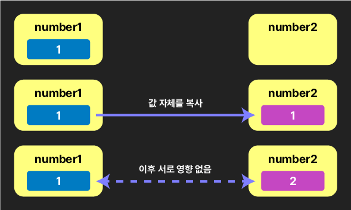

# 제목 없음

Date: 2025년 12월 30일
완료: No
1일후: 핵심요약+문제: No
7일 후: 퀴즈+문제: No
강의 넘버: 17~20

# JavaScript 연산자, 객체/배열, 스코프 완벽 가이드

## 📚 목차

1. [기타 연산자들](https://claude.ai/chat/7d83879a-448f-4c0e-9b8e-78520f28d4b0#1-%EA%B8%B0%ED%83%80-%EC%97%B0%EC%82%B0%EC%9E%90%EB%93%A4)
2. [연산자 우선순위](https://claude.ai/chat/7d83879a-448f-4c0e-9b8e-78520f28d4b0#2-%EC%97%B0%EC%82%B0%EC%9E%90-%EC%9A%B0%EC%84%A0%EC%88%9C%EC%9C%84)
3. [객체와 배열 기초](https://claude.ai/chat/7d83879a-448f-4c0e-9b8e-78520f28d4b0#3-%EA%B0%9D%EC%B2%B4%EC%99%80-%EB%B0%B0%EC%97%B4-%EA%B8%B0%EC%B4%88)
4. [원시 타입 vs 참조 타입](https://claude.ai/chat/7d83879a-448f-4c0e-9b8e-78520f28d4b0#4-%EC%9B%90%EC%8B%9C-%ED%83%80%EC%9E%85-vs-%EC%B0%B8%EC%A1%B0-%ED%83%80%EC%9E%85)
5. [블록문과 스코프](https://claude.ai/chat/7d83879a-448f-4c0e-9b8e-78520f28d4b0#5-%EB%B8%94%EB%A1%9D%EB%AC%B8%EA%B3%BC-%EC%8A%A4%EC%BD%94%ED%94%84)

---

## 1. 기타 연산자들

### 1.1 쉼표 연산자 (,)

| 속성 | 설명 | 사용 상황 | 예시 코드 |
| --- | --- | --- | --- |
| **동작 방식** | 왼쪽부터 차례로 실행 후 마지막 값 반환 | 여러 표현식을 한 줄에 실행 | `(x++, y++, z++)` |
| **변수 선언** | 한 줄에 여러 변수 선언 | 관련된 변수들을 묶어서 선언 | `let x = 1, y = 2, z = 3;` |
| **반환값** | 가장 마지막 표현식의 결과 | 복잡한 표현식 작성 | `(a=1, b=2, c=3)` → 3 반환 |

**상세 설명:**
쉼표 연산자는 여러 개의 표현식을 순차적으로 실행하고, 가장 마지막 표현식의 결과만을 반환합니다. 각 표현식은 독립적으로 실행되며, 부수 효과(side effect)를 가질 수 있습니다.

```jsx
let x = 1, y = 2, z = 3;
console.log(x, y, z); // 1 2 3

// 마지막으로 실행한 것 반환
console.log(
  (++x, y += x, z *= y)
);
// 실행 순서:
// 1. ++x → x는 2가 됨
// 2. y += x → y는 2 + 2 = 4가 됨
// 3. z *= y → z는 3 * 4 = 12가 됨
// 4. 마지막 표현식의 결과인 12 반환

```

---

### 1.2 null 병합 연산자 (??)

| 연산자 | 대체 조건 | 특징 | 사용 상황 |
| --- | --- | --- | --- |
| `||` | falsy 값 전체 | `false`, `0`, `''`, `null`, `undefined`, `NaN` | 일반적인 기본값 설정 |
| `??` | `null`, `undefined`만 | 오직 두 가지만 대체 | `0`, `false`, `''`를 유효한 값으로 처리 |

**상세 설명:**`??` 연산자는 `||` 연산자와 달리 **null과 undefined만을 "값이 없음"으로 간주**합니다. 이는 0, 빈 문자열(''), false 등의 falsy 값을 의도적으로 사용할 때 중요합니다.

```jsx
let x;
x ?? console.warn(x, 'x에 값이 없습니다.'); // undefined → 경고 출력

x = 0;
x ?? console.warn(x, 'x에 값이 없습니다.'); // 0은 유효한 값 → 경고 없음

x = null;
x ?? console.warn(x, 'x에 값이 없습니다.'); // null → 경고 출력

```

**|| vs ?? 비교:**

```jsx
let a = false;
let b = 0;
let c = '';
let d = null;
let e;

console.log(
  a ?? '기본값',  // false (false는 유효한 값으로 처리)
  b ?? '기본값',  // 0 (0은 유효한 값으로 처리)
  c ?? '기본값',  // '' (빈 문자열도 유효한 값으로 처리)
  d ?? '기본값',  // '기본값' (null은 대체됨)
  e ?? '기본값',  // '기본값' (undefined는 대체됨)
);

// || 연산자였다면:
console.log(
  a || '기본값',  // '기본값' (false는 falsy)
  b || '기본값',  // '기본값' (0은 falsy)
  c || '기본값',  // '기본값' (''는 falsy)
  d || '기본값',  // '기본값' (null은 falsy)
  e || '기본값',  // '기본값' (undefined는 falsy)
);

```

**실용 예제:**

```jsx
let baby1 = '홍길동';
let baby2; // 아직 이름을 짓지 못함

const nameTag1 = baby1 ?? '1번 아기';
const nameTag2 = baby2 ?? '2번 아기';

console.log(nameTag1, nameTag2); // '홍길동' '2번 아기'

```

---

### 1.3 병합 할당 연산자

| 연산자 | 동작 조건 | 설명 | 예시 |
| --- | --- | --- | --- |
| `||=` | 좌변이 falsy일 때 | falsy면 우변 값 할당 | `x ||= 100` |
| `&&=` | 좌변이 truthy일 때 | truthy면 우변 값 할당 | `y &&= '새 값'` |
| `??=` | 좌변이 null/undefined일 때 | null/undefined면 우변 값 할당 | `z ??= '기본값'` |

**상세 설명:**
병합 할당 연산자는 조건부로 값을 할당하는 단축 표기법입니다. 기존 값의 상태에 따라 새 값을 할당할지 결정합니다.

```jsx
let x = 0;
let y = '';
let z = null;

x ||= 100;           // x는 0(falsy)이므로 100으로 변경
y &&= '있어야 바뀜';  // y는 ''(falsy)이므로 변경 안 됨
z ??= '기본값';      // z는 null이므로 '기본값'으로 변경

console.log(x, y, z); // 100 '' '기본값'

```

**기존 코드와의 비교:**

```jsx
// ||= 는 다음과 동일:
x = x || 100;

// &&= 는 다음과 동일:
y = y && '새 값';

// ??= 는 다음과 동일:
z = z ?? '기본값';

```

---

## 2. 연산자 우선순위

### 2.1 우선순위 표

| 순위 | 연산자 | 설명 | 예시 |
| --- | --- | --- | --- |
| **1** | `!`, `+`, `-`, `++`, `--`, `typeof` | 단항 연산자 | `!true`, `++x`, `typeof x` |
| **2** | `**` | 거듭제곱 | `2 ** 3` → 8 |
| **3** | `*`, `/`, `%` | 곱셈, 나눗셈, 나머지 | `10 * 2`, `10 / 3`, `10 % 3` |
| **4** | `+`, `-` | 덧셈, 뺄셈 | `5 + 3`, `5 - 3` |
| **5** | `<`, `<=`, `>`, `>=` | 비교 연산자 | `5 > 3` |
| **6** | `==`, `!=`, `===`, `!==` | 동등/일치 연산자 | `5 === 5` |
| **7** | `&&` | 논리 AND | `true && false` |
| **8** | `||` | 논리 OR | `true || false` |
| **9** | `=`, `+=`, `-=`, `*=`, `/=`, `%=`, `**=`, `&&=`, `||=`, `??=` | 할당 연산자 | `x = 5`, `x += 3` |
| **10** | `,` | 쉼표 연산자 | `(x++, y++)` |

**전체 우선순위:** [MDN 연산자 우선순위 문서](https://developer.mozilla.org/ko/docs/Web/JavaScript/Reference/Operators/Operator_Precedence)

---

### 2.2 우선순위 적용 예제

**예제 1: 복합 연산**

```jsx
let x = 1;
let y = 19 === 3 + 4 * 2 ** ++x;
// 실행 순서:
// 1. ++x → x는 2가 됨 (우선순위 1)
// 2. 2 ** 2 → 4 (우선순위 2)
// 3. 4 * 4 → 16 (우선순위 3)
// 4. 3 + 16 → 19 (우선순위 4)
// 5. 19 === 19 → true (우선순위 6)
// 6. y = true (우선순위 9)

console.log(y); // true

```

**예제 2: 논리 연산과 괄호**

```jsx
console.log(
  2 > 3 || 4 % 2 === 0,      // false || true → true
  2 > (3 || 4) % 2 === 0,    // 2 > (3 % 2) === 0 → 2 > 1 === 0 → false
  2 > 3 || 4 % (2 === 0)     // 2 > 3 || 4 % false (오류 발생 가능)
);

```

**괄호 사용의 중요성:**

- 괄호는 최우선 순위를 가짐
- 복잡한 표현식에서는 명확성을 위해 괄호 사용 권장
- 가독성과 의도 명확화에 유리

---

## 3. 객체와 배열 기초

### 3.1 객체 (Object)

**개념:**

- 원시 타입이 아닌 **참조 타입**
- 키(key)와 값(value)의 쌍으로 이루어진 **프로퍼티(property)** 집합
- 복합적인 정보를 하나의 단위로 관리
- JavaScript에서 원시 타입이 아닌 모든 데이터는 근본적으로 객체

**문법:**

```jsx
const objName = {
  key1: value1,
  key2: value2,
  // ...
};
// ⚠️ 중괄호는 블록문이 아닌 객체 리터럴!

```

**기본 예제:**

```jsx
const person1 = {
  name: '김철수',
  age: 25,
  married: false
};

console.log(typeof person1); // 'object'
console.log(person1); // { name: '김철수', age: 25, married: false }

```

---

### 3.2 객체 프로퍼티 접근

| 접근 방법 | 문법 | 사용 상황 | 예시 |
| --- | --- | --- | --- |
| **점 표기법** | `obj.key` | 키 이름이 확정적일 때 | `person1.name` |
| **대괄호 표기법** | `obj['key']` | 동적 키, 특수문자 포함 키 | `person1['name']`, `obj[변수]` |

**상세 예제:**

```jsx
// 점 표기법
console.log(
  person1.name,     // '김철수'
  person1.age,      // 25
  person1.married   // false
);

// 대괄호 표기법
console.log(
  person1['name'],    // '김철수'
  person1['age'],     // 25
  person1['married']  // false
);

// 존재하지 않는 키 접근 시 undefined 반환
console.log(person1.birthdate); // undefined
console.log(person1['job']);    // undefined

```

**in 연산자: 키 존재 여부 확인**

```jsx
console.log(
  'age' in person1,  // true
  'job' in person1   // false
);

```

---

### 3.3 객체 프로퍼티 수정 및 추가

| 작업 | 문법 | 설명 | 예시 |
| --- | --- | --- | --- |
| **값 수정** | `obj.key = newValue` | 기존 프로퍼티 값 변경 | `person1.age = 26` |
| **프로퍼티 추가** | `obj.newKey = value` | 새로운 프로퍼티 생성 | `person1.job = 'developer'` |

```jsx
// 특정 프로퍼티의 값 변경
person1.age = 26;
person1['married'] = true;

console.log(person1);
// { name: '김철수', age: 26, married: true }

// 새 프로퍼티 추가
person1.job = 'developer';
person1['bloodtype'] = 'AB';

console.log(person1);
// { name: '김철수', age: 26, married: true, job: 'developer', bloodtype: 'AB' }

```

**⚠️ 중요:** const로 선언된 객체도 **내부 프로퍼티는 수정 가능**합니다!

- const는 변수가 참조하는 메모리 주소의 변경만 금지
- 객체 내부 값의 변경은 허용

---

### 3.4 배열 (Array)

**개념:**

- 순서가 있는 데이터의 집합
- 0부터 시작하는 인덱스로 요소에 접근
- 다양한 자료형을 하나의 배열에 포함 가능
- 객체의 특수한 형태 (typeof 결과는 'object')

**기본 예제:**

```jsx
const winners = [12, 592, 7, 48];
const weekdays = ['월', '화', '수', '목', '금', '토', '일'];

// 자료형에 관계없이 한 배열에 넣을 수 있음
const randoms = ['홍길동', -24, true, null, undefined];

console.log(typeof winners); // 'object'
console.log(winners, weekdays, randoms);

```

---

### 3.5 배열 값과 길이 접근

| 작업 | 문법 | 설명 | 예시 |
| --- | --- | --- | --- |
| **요소 접근** | `arr[index]` | 인덱스로 특정 요소 접근 (0부터 시작) | `winners[0]` |
| **길이 확인** | `arr.length` | 배열의 요소 개수 | `winners.length` |
| **마지막 요소** | `arr[arr.length - 1]` | 배열의 마지막 요소 접근 | `winners[winners.length - 1]` |

```jsx
// 특정 순서의 값에 접근 (0부터 시작)
console.log(winners[0], weekdays[6], randoms[3]);
// 12 '일' null

// 배열의 길이(요소의 개수)
console.log(winners.length, weekdays.length, randoms.length);
// 4 7 5

// 마지막 요소 얻기
console.log(winners[winners.length - 1]); // 48

```

**⚠️ 범위 초과 접근:**

```jsx
console.log(winners[winners.length]); // undefined
// 배열의 범위를 넘어서 접근하면 undefined 반환

```

---

### 3.6 배열 수정 및 추가

| 작업 | 문법 | 설명 | 예시 |
| --- | --- | --- | --- |
| **요소 수정** | `arr[index] = newValue` | 특정 위치의 값 변경 | `numbers[2] = 5` |
| **맨 끝 추가** | `arr.push(value)` | 배열 끝에 요소 추가 | `numbers.push(10)` |

```jsx
const numbers = [1, 2, 3];

// 특정 위치의 값 수정
numbers[2] = 5;
console.log(numbers); // [1, 2, 5]

// 맨 끝에 값 추가
numbers.push(10);
console.log(numbers); // [1, 2, 5, 10]

```

**⚠️ 중요:** const로 선언된 배열도 **내부 요소는 수정 가능**합니다!

---

### 3.7 객체와 배열의 중첩

**복잡한 데이터 구조:**
객체 안에 배열, 배열 안에 객체, 배열 안에 배열 등 자유롭게 중첩 가능

**예제 1: 객체 안에 배열과 객체**

```jsx
const person2 = {
  name: '김달순',
  age: 23,
  languages: ['Korean', 'English', 'French'],
  education: {
    school: '한국대',
    major: ['컴퓨터공학', '전자공학'],
    graduated: true,
  }
};

console.log(person2.languages[2]);          // 'French'
console.log(person2.education.graduated);   // true
console.log(person2.education.major[0]);    // '컴퓨터공학'

```

**예제 2: 2차원 배열**

```jsx
const groups = [[1, 2], [3, 4, 5], [6, 7, 8, 9]];

console.log(groups[1][2]); // 5
// groups[1] → [3, 4, 5]
// [3, 4, 5][2] → 5

```

**예제 3: 객체 배열**

```jsx
const weapons = [
  { name: '롱소드', damage: 30, design: ['화룡검', '뇌신검'] },
  { name: '활', damage: 12 },
  { name: '워해머', damage: 48 },
];

console.log(weapons[2].damage);        // 48
console.log(weapons[0].design[0]);     // '화룡검'

```

---

## 4. 원시 타입 vs 참조 타입

### 4.1 개념 정리

| 특징 | 원시 타입 (Primitive) | 참조 타입 (Reference) |
| --- | --- | --- |
| **종류** | Number, String, Boolean, null, undefined, Symbol, BigInt | Object, Array, Function 등 |
| **복사 방식** | 값에 의한 복사 (Copy by Value) | 참조에 의한 복사 (Copy by Reference) |
| **메모리 위치** | 변수 영역에 값 직접 저장 | 변수는 메모리 주소만 저장, 실제 데이터는 힙(Heap) 영역 |
| **복사 후 독립성** | ✅ 완전히 독립적 | ❌ 같은 객체를 참조 |

---

### 4.2 원시 타입: 값에 의한 복사

**특징:**

- 변수에 **실제 값이 저장**됨
- 복사 시 **새로운 값이 생성**됨
- 한 변수의 변경이 다른 변수에 **영향을 주지 않음**

```jsx
let number1 = 1;
let string1 = 'ABC';
let bool1 = true;

let number2 = number1;
let string2 = string1;
let bool2 = bool1;

// 값 변경
number2 = 2;
string2 = '가나다';
bool2 = false;

console.log('~1:', number1, string1, bool1); // 1 'ABC' true
console.log('~2:', number2, string2, bool2); // 2 '가나다' false

```

**메모리 구조:**



1. **초기 상태:** number1에 1 저장
2. **복사:** number2에 number1의 **값(1)을 복사**
3. **변경:** number2를 2로 변경해도 number1은 영향 없음 (독립적)

---

### 4.3 참조 타입: 참조에 의한 복사

**특징:**

- 변수에 **메모리 주소(참조)가 저장**됨
- 복사 시 **같은 객체를 가리킴**
- 한 변수를 통한 변경이 **모든 참조에 영향**

**객체 예제:**

```jsx
const obj1 = {
  num: 1, str: 'ABC', bool: true
};
const obj2 = obj1;  // 같은 객체를 참조
// obj2 = {}; // ⚠️ 오류 - 다른 객체 할당 불가 (const)

console.log('obj1:', obj1); // { num: 1, str: 'ABC', bool: true }
console.log('obj2:', obj2); // { num: 1, str: 'ABC', bool: true }

// obj2를 통해 수정
obj2.num = 2;
obj2.str = '가나다';
obj2.bool = false;

console.log('obj1:', obj1); // { num: 2, str: '가나다', bool: false }
console.log('obj2:', obj2); // { num: 2, str: '가나다', bool: false }
// obj1도 함께 변경됨!

```

**배열 예제:**

```jsx
const array1 = [1, 'ABC', true];
const array2 = array1;  // 같은 배열을 참조
// array2 = []; // ⚠️ 오류 - 다른 배열 할당 불가 (const)

console.log('array1:', array1); // [1, 'ABC', true]
console.log('array2:', array2); // [1, 'ABC', true]

// array2를 통해 수정
array2[0] = 3;
array2[1] = 'def';
array2[2] = false;

console.log('array1:', array1); // [3, 'def', false]
console.log('array2:', array2); // [3, 'def', false]
// array1도 함께 변경됨!

```


---

### 4.4 메모리 구조 상세 분석

**원시 타입 메모리:**


- 변수 영역에 값이 직접 저장
- 각 변수는 독립적인 메모리 공간 사용

**참조 타입 메모리 - 객체:**


- 변수 영역: 메모리 주소(@@@) 저장
- 힙(Heap) 영역: 실제 객체 데이터 저장
- obj1과 obj2는 같은 주소를 참조 → 같은 객체

**참조 타입 메모리 - 배열:**


- 변수 영역: 메모리 주소(###) 저장
- 힙(Heap) 영역: 배열 요소들(인덱스별) 저장
- array1과 array2는 같은 주소를 참조 → 같은 배열

---

### 4.5 const와 참조 타입

**중요한 특징:**

```jsx
const obj = { value: 1 };
obj.value = 2;  // ✅ 가능 - 객체 내부 수정
obj = {};       // ❌ 오류 - 다른 객체 할당 불가

const arr = [1, 2, 3];
arr[0] = 10;    // ✅ 가능 - 배열 요소 수정
arr.push(4);    // ✅ 가능 - 요소 추가
arr = [];       // ❌ 오류 - 다른 배열 할당 불가

```

**이유:**

- const는 **변수가 저장하는 메모리 주소의 변경**을 금지
- 객체/배열의 **내부 값 변경은 주소 변경이 아님**
- 완전히 새로운 객체/배열 할당만 불가능

**내부 변경 방지:**

```jsx
const obj = Object.freeze({ value: 1 });
obj.value = 2;  // 무시됨 (strict mode에서는 에러)

```

---

## 5. 블록문과 스코프

### 5.1 블록문 (Block Statement)

**정의:** [MDN 블록문 문서](https://developer.mozilla.org/ko/docs/Web/JavaScript/Reference/Statements/block)

| 특징 | 설명 |
| --- | --- |
| **문법** | 중괄호 `{ }` 로 묶인 문장들의 집합 |
| **용도** | 제어문, 함수, 논리적 그룹화 |
| **스코프 생성** | 새로운 블록 스코프 생성 |

```jsx
{
  console.log('블록문');
}

// 일반적으로 단독 사용보다는 제어문과 함께 사용
if (true) {
  console.log('조건문의 블록');
}

```

---

### 5.2 스코프 (Scope)

**정의:** 변수와 상수의 유효 범위

**기본 규칙:**

```jsx
// 블록 안의 변수는 밖에서 사용 불가
{
  const x = 'Hello';
  let y = 'world!';
  console.log(x, y); // ✅ 가능
}

console.log(x); // ❌ ReferenceError: x is not defined
console.log(y); // ❌ ReferenceError: y is not defined

```

**바깥 변수는 안쪽에서 접근 가능:**

```jsx
let x = 1;

{
  let y = 2;
  console.log(x, y); // 1 2 - ✅ 가능
}

console.log(x);    // 1 - ✅ 가능
console.log(y);    // ❌ ReferenceError

```

---

### 5.3 변수 섀도잉 (Variable Shadowing)

**안쪽 블록에서 변수 재선언 시 바깥 것을 덮어씀:**

```jsx
const xx = 0;
let yy = 'Hello!';
console.log(xx, yy); // 0 'Hello!'

{
  const xx = 1;  // 💡 블록 안에서는 바깥의 const 재선언 가능
  let yy = '안녕하세요~';

  console.log(xx, yy); // 1 '안녕하세요~'
  // 블록 안쪽의 변수가 바깥 것을 가림 (shadowing)
}

console.log(xx, yy); // 0 'Hello!'
// 블록 벗어나면 다시 바깥 변수 사용

```

**⚠️ 주의사항:**

```jsx
let x = 1;
{
  x = 2;  // const, let 없이 사용 - 바깥 변수 수정!
}
console.log(x); // 2

let y = 1;
{
  let y = 2;  // const, let 있음 - 새로운 지역 변수 선언!
}
console.log(y); // 1

```

---

### 5.4 스코프 체인 (Scope Chain)

**개념:** 블록 안에 변수/상수가 없으면 **바깥쪽으로 찾아 나가는 메커니즘**

**스택 구조와 유사:**


- 후입선출 (LIFO: Last In, First Out)
- 나중에 추가된 스코프가 먼저 검색됨

**예제:**

```jsx
let a = 0;
let b = 1;
let c = 2;
console.log('시점 1:', a, b, c); // 0 1 2

{
  let a = 'A';
  let b = 'B';
  console.log('시점 2:', a, b, c); // 'A' 'B' 2 (c는 바깥에서 찾음)

  {
    let a = '가';
    console.log('시점 3:', a, b, c); // '가' 'B' 2 (b, c는 바깥에서 찾음)
  }

  console.log('시점 4:', a, b, c); // 'A' 'B' 2
}

console.log('시점 5:', a, b, c); // 0 1 2

```

**스코프 체인 시각화:**


- 시점 3: a는 가장 안쪽, b는 중간, c는 전역에서 찾음
- 없으면 계속 바깥으로 체이닝

---

### 5.5 전역 vs 지역 변수/상수

| 구분 | 전역 (Global) | 지역 (Local) |
| --- | --- | --- |
| **위치** | 모든 블록 밖 | 블록 안 |
| **메모리 영역** | 데이터 영역 | 스택 영역 |
| **접근 범위** | 코드 어디서든 | 해당 블록 내부만 |
| **생명주기** | 프로그램 종료 시 | 블록 종료 시 |
| **사용 권장** | ⚠️ 최소화 | ✅ 적극 권장 |

**메모리 관점:**

- **데이터 영역:** 전역 변수 저장, 프로그램 종료까지 유지
- **스택 영역:** 지역 변수 저장, 블록 종료 시 자동 소멸

**예제:**

```jsx
// 전역 변수 - 데이터 영역
let globalVar = '전역';

function myFunction() {
  // 지역 변수 - 스택 영역
  let localVar = '지역';

  console.log(globalVar); // ✅ 전역 변수 접근 가능
  console.log(localVar);  // ✅ 지역 변수 접근 가능
}

myFunction();
console.log(globalVar);  // ✅ 전역 변수 접근 가능
console.log(localVar);   // ❌ 지역 변수 접근 불가

```

**⚠️ 전역 변수 사용 최소화 이유:**

1. 메모리 낭비 (프로그램 종료까지 유지)
2. 네임스페이스 오염
3. 의도치 않은 값 변경 위험
4. 디버깅 어려움

**✅ 권장 사항:**

- 변수/상수는 **사용할 블록 내에서 선언**
- 필요한 범위에서만 접근 가능하도록 제한
- 메모리 절약 및 코드 안정성 향상

---

## 💡 핵심 요약

### 기타 연산자

- **쉼표(,)**: 여러 표현식 순차 실행, 마지막 값 반환
- **??(null 병합)**: null/undefined만 대체 (0, false, ''는 유효)
- **||=, &&=, ??=**: 조건부 할당 연산자

### 연산자 우선순위

- 단항(1) > 거듭제곱(2) > 곱셈/나눗셈(3) > 덧셈/뺄셈(4) > 비교(5) > 동등(6) > AND(7) > OR(8) > 할당(9) > 쉼표(10)

### 객체와 배열

- **객체**: 키-값 쌍의 프로퍼티 집합, 점/대괄호 표기법 접근
- **배열**: 순서 있는 데이터, 0부터 인덱스 접근, length 속성
- **const** 선언도 내부 수정 가능 (주소는 고정, 내용은 변경 가능)

### 원시 vs 참조 타입

- **원시**: 값 복사, 독립적, 변수 영역 저장
- **참조**: 주소 복사, 공유, 힙 영역 저장, 한 곳 수정 시 모두 영향

### 스코프

- **블록 스코프**: 블록 내 선언된 변수는 밖에서 접근 불가
- **스코프 체인**: 없으면 바깥으로 찾아감 (체이닝)
- **전역**: 데이터 영역, 프로그램 종료까지, 최소화
- **지역**: 스택 영역, 블록 종료 시 소멸, 권장

---

## 📝 복습 퀴즈

### 퀴즈 1

다음 코드의 출력 결과는?

```jsx
let x = 5, y = 10;
console.log((++x, y += x, x * y));

```

① 60
② 96
③ 66
④ 90

**정답: ②**

**해설:**
쉼표 연산자는 왼쪽부터 차례로 실행하고 마지막 값을 반환합니다.

1. `++x` → x는 6이 됨
2. `y += x` → y는 10 + 6 = 16이 됨
3. `x * y` → 6 * 16 = 96 (이 값이 반환됨)

문서 내용: "쉼표 연산자는 왼쪽부터 차례로 실행, 마지막 것 반환"

---

### 퀴즈 2

다음 중 ?? 연산자로 대체되는 값은?

① `0 ?? '기본값'` → '기본값'
② `false ?? '기본값'` → '기본값'
③ `'' ?? '기본값'` → '기본값'
④ `undefined ?? '기본값'` → '기본값'

**정답: ④**

**해설:**`??` (null 병합 연산자)는 **오직 null과 undefined만** "값이 없음"으로 간주합니다.

- `0`, `false`, `''`는 falsy이지만 유효한 값으로 처리
- `null`, `undefined`만 대체됨
- `||` 연산자는 모든 falsy 값을 대체

문서 내용: "??는 falsy가 아닌 null 또는 undefined만 대체"

---

### 퀴즈 3

객체와 배열 접근에 대한 설명으로 **올바른** 것은?

① 객체는 대괄호 표기법만 사용 가능하다
② 배열의 인덱스는 1부터 시작한다
③ 존재하지 않는 키/인덱스 접근 시 null을 반환한다
④ const로 선언된 객체/배열도 내부 값은 수정 가능하다

**정답: ④**

**해설:**

- const는 변수가 참조하는 **메모리 주소의 변경**만 금지합니다.
- 객체나 배열의 **내부 값 변경은 주소 변경이 아니므로** 가능합니다.
- 점 표기법과 대괄호 표기법 모두 사용 가능 (①)
- 배열 인덱스는 0부터 시작 (②)
- 존재하지 않는 키/인덱스는 undefined 반환 (③)

문서 내용: "💡 const임에도 그 내용은 수정할 수 있음에 주목!"

---

### 퀴즈 4

다음 코드의 출력 결과는?

```jsx
const obj1 = { value: 10 };
const obj2 = obj1;
obj2.value = 20;
console.log(obj1.value);

```

① 10
② 20
③ undefined
④ 오류 발생

**정답: ②**

**해설:**
객체는 **참조 타입**이므로 `obj2 = obj1`는 같은 객체를 참조합니다.

- obj2를 통한 수정이 obj1에도 반영됨
- 두 변수가 같은 메모리 주소를 가리키기 때문
- 원시 타입과 달리 값이 복사되지 않고 주소가 복사됨

문서 내용: "참조에 의한 복사 copy by reference"

---

### 퀴즈 5

다음 코드의 출력 결과는?

```jsx
let x = 'outer';
{
  let x = 'inner';
  console.log(x);
}
console.log(x);

```

① inner, inner
② outer, outer
③ inner, outer
④ 오류 발생

**정답: ③**

**해설:**
블록 안에서 같은 이름의 변수를 재선언하면 **섀도잉(shadowing)** 이 발생합니다.

- 블록 안: 'inner' (안쪽 변수가 바깥 것을 가림)
- 블록 밖: 'outer' (블록 벗어나면 다시 바깥 변수)
- 각각 다른 스코프의 독립적인 변수

문서 내용: "블록 안쪽에 변수나 상수가 새로 선언되면 바깥 것을 덮어씀"

---

### 퀴즈 6

스코프 체인에 대한 설명으로 **틀린** 것은?

① 블록 안에 변수가 없으면 바깥으로 찾아간다
② 스택처럼 후입선출 구조로 동작한다
③ 가장 가까운 스코프부터 검색한다
④ 바깥 스코프의 변수는 안쪽에서 절대 접근할 수 없다

**정답: ④**

**해설:**
스코프 체인은 **바깥 스코프의 변수를 안쪽에서 접근 가능**하게 합니다.

- 안쪽 → 바깥으로 체이닝하며 변수 검색
- 가장 가까운 스코프부터 찾음
- 없으면 계속 바깥으로 (전역까지)
- 반대로 바깥에서 안쪽 변수는 접근 불가

문서 내용: "블록 안에 해당 변수/상수가 없으면 바깥쪽으로 찾아 나감 - 체이닝"

---

### 퀴즈 7

전역 변수 사용을 최소화해야 하는 이유가 **아닌** 것은?

① 프로그램 종료까지 메모리를 차지한다
② 코드 어디서든 접근 가능해 의도치 않은 변경이 발생할 수 있다
③ 데이터 영역에 저장되어 스택 오버플로우를 유발한다
④ 네임스페이스를 오염시킨다

**정답: ③**

**해설:**
전역 변수는 **데이터 영역**에 저장되어 **스택 영역과 무관**합니다.

- 스택 오버플로우는 주로 재귀 호출이나 지역 변수 과다 사용 시 발생
- 전역 변수의 문제점: 메모리 낭비(①), 의도치 않은 변경(②), 네임스페이스 오염(④)

문서 내용: "전역 변수/상수 - 데이터 영역에 위치, 지역 변수/상수 - 스택 영역에 위치"

---

### 퀴즈 8

다음 코드의 출력 결과는?

```jsx
const arr = [1, 2, 3];
console.log(arr[arr.length]);

```

① 3
② undefined
③ null
④ 오류 발생

**정답: ②**

**해설:**`arr.length`는 3이므로 `arr[3]`를 접근합니다.

- 배열 인덱스는 0부터 시작: [0]=1, [1]=2, [2]=3
- arr[3]는 존재하지 않는 인덱스
- 배열 범위를 넘어서 접근하면 **undefined** 반환

문서 내용: "💡 배열의 범주 너머로 접근시 undefined 반환"

---

## 🎯 연습 문제

### 문제 1: null 병합 연산자 활용

사용자 설정값이 있으면 사용하고, 없으면 기본값을 사용하는 코드를 작성하세요.

**요구사항:**

- `userSettings` 객체에 `theme`, `fontSize`, `notifications` 설정이 있음
- `theme`가 null/undefined면 'light' 사용
- `fontSize`가 0이어도 유효한 값으로 처리
- `notifications`가 false여도 유효한 값으로 처리

**기본 코드:**

```jsx
const userSettings = {
  theme: null,
  fontSize: 0,
  notifications: false
};

// 여기에 코드 작성
const theme = ;
const fontSize = ;
const notifications = ;

console.log(theme, fontSize, notifications);
// 예상 출력: 'light' 0 false

```

**정답:**

```jsx
const userSettings = {
  theme: null,
  fontSize: 0,
  notifications: false
};

const theme = userSettings.theme ?? 'light';
const fontSize = userSettings.fontSize ?? 16;
const notifications = userSettings.notifications ?? true;

console.log(theme, fontSize, notifications); // 'light' 0 false

```

**해설:**

- `??` 연산자는 null/undefined만 대체하므로 `0`과 `false`를 유효한 값으로 처리합니다.
- `||` 연산자를 사용했다면 `0`과 `false`도 대체되어 원하지 않는 결과가 나옵니다:
    
    ```jsx
    // || 사용 시 (잘못된 방법):const fontSize = userSettings.fontSize || 16; // 16 (0이 대체됨)const notifications = userSettings.notifications || true; // true (false가 대체됨)
    
    ```
    
- `??`는 "값이 없음(null/undefined)"과 "의미 있는 falsy 값(0, false, '')"을 구분합니다.

---

### 문제 2: 중첩 객체 데이터 접근

학생 정보 객체에서 필요한 데이터를 추출하세요.

**요구사항:**

- 학생의 두 번째 취미를 출력
- 전공 중 첫 번째 전공을 출력
- 성적 중 수학 점수를 출력

**기본 코드:**

```jsx
const student = {
  name: '김철수',
  age: 20,
  hobbies: ['독서', '등산', '요리'],
  education: {
    school: '한국대학교',
    major: ['컴퓨터공학', '수학'],
    grades: {
      korean: 85,
      math: 92,
      english: 88
    }
  }
};

// 여기에 코드 작성
const secondHobby = ;
const firstMajor = ;
const mathScore = ;

console.log(secondHobby, firstMajor, mathScore);
// 예상 출력: '등산' '컴퓨터공학' 92

```

**정답:**

```jsx
const student = {
  name: '김철수',
  age: 20,
  hobbies: ['독서', '등산', '요리'],
  education: {
    school: '한국대학교',
    major: ['컴퓨터공학', '수학'],
    grades: {
      korean: 85,
      math: 92,
      english: 88
    }
  }
};

const secondHobby = student.hobbies[1];
const firstMajor = student.education.major[0];
const mathScore = student.education.grades.math;

console.log(secondHobby, firstMajor, mathScore); // '등산' '컴퓨터공학' 92

```

**해설:**

- **배열 접근:** `hobbies[1]` - 인덱스 0부터 시작하므로 두 번째는 1
- **중첩 객체 접근:** `education.major[0]` - 점 표기법으로 객체 접근 후 배열 인덱스
- **깊은 중첩 접근:** `education.grades.math` - 여러 단계의 점 표기법 체이닝
- 대괄호 표기법으로도 가능: `student['education']['grades']['math']`

---

### 문제 3: 참조 타입 복사 문제 해결

객체를 복사했는데 원본이 변경되는 문제를 해결하세요.

**요구사항:**

- `product1`을 복사하여 `product2`를 만들되, 독립적으로 만들기
- `product2`의 가격을 변경해도 `product1`에 영향을 주지 않아야 함

**기본 코드:**

```jsx
const product1 = {
  name: '노트북',
  price: 1000000,
  specs: {
    cpu: 'i7',
    ram: 16
  }
};

// 여기에 코드 작성 (객체 복사)
const product2 = ;

// product2 수정
product2.price = 1200000;
product2.specs.ram = 32;

console.log('product1 price:', product1.price); // 1000000이어야 함
console.log('product1 ram:', product1.specs.ram); // 16이어야 함
console.log('product2 price:', product2.price); // 1200000
console.log('product2 ram:', product2.specs.ram); // 32

```

**정답:**

```jsx
const product1 = {
  name: '노트북',
  price: 1000000,
  specs: {
    cpu: 'i7',
    ram: 16
  }
};

// 얕은 복사로는 중첩 객체 문제 해결 안 됨
// const product2 = { ...product1 }; // ❌ specs는 여전히 참조 공유

// 깊은 복사 (중첩 객체까지 완전히 복사)
const product2 = JSON.parse(JSON.stringify(product1));

product2.price = 1200000;
product2.specs.ram = 32;

console.log('product1 price:', product1.price); // 1000000
console.log('product1 ram:', product1.specs.ram); // 16
console.log('product2 price:', product2.price); // 1200000
console.log('product2 ram:', product2.specs.ram); // 32

```

**해설:**

- **문제점:** 단순 할당(`product2 = product1`)은 같은 객체를 참조
- **얕은 복사:** 스프레드 연산자(`{ ...product1 }`)는 1단계만 복사, 중첩 객체는 여전히 참조
- **깊은 복사:** `JSON.parse(JSON.stringify())` 방법으로 중첩까지 완전히 복사
- **대안:** lodash의 `_.cloneDeep()` 또는 structuredClone() (최신 브라우저)

```jsx
// 얕은 복사의 문제:
const product2 = { ...product1 };
product2.specs.ram = 32; // product1.specs.ram도 32로 변경됨! (참조 공유)

```

---

### 문제 4: 스코프 체인 이해

다음 코드의 출력 결과를 예측하고, 그 이유를 설명하세요.

**기본 코드:**

```jsx
let global = '전역';

{
  let outer = '외부';
  console.log('위치 1:', global, outer);

  {
    let inner = '내부';
    console.log('위치 2:', global, outer, inner);

    {
      let deepest = '가장 깊음';
      console.log('위치 3:', global, outer, inner, deepest);
    }

    console.log('위치 4:', global, outer, inner);
    // console.log(deepest); // 여기서 deepest 접근하면?
  }

  console.log('위치 5:', global, outer);
  // console.log(inner); // 여기서 inner 접근하면?
}

console.log('위치 6:', global);
// console.log(outer); // 여기서 outer 접근하면?

```

**정답:**

```
위치 1: 전역 외부
위치 2: 전역 외부 내부
위치 3: 전역 외부 내부 가장 깊음
위치 4: 전역 외부 내부
위치 5: 전역 외부
위치 6: 전역

주석 해제 시:
- 위치 4에서 deepest: ReferenceError (블록 벗어남)
- 위치 5에서 inner: ReferenceError (블록 벗어남)
- 위치 6에서 outer: ReferenceError (블록 벗어남)

```

**해설:스코프 체인 원리:**

1. 변수를 찾을 때 현재 스코프부터 검색
2. 없으면 바깥 스코프로 이동 (체이닝)
3. 전역 스코프까지 찾아도 없으면 ReferenceError

**각 위치별 접근 가능한 변수:**

- 위치 1: global (전역), outer (현재)
- 위치 2: global (전역), outer (바깥), inner (현재)
- 위치 3: global (전역), outer (바깥바깥), inner (바깥), deepest (현재)
- 위치 4: deepest 스코프 종료, inner까지만 접근 가능
- 위치 5: inner 스코프 종료, outer까지만 접근 가능
- 위치 6: outer 스코프 종료, global만 접근 가능

**메모리 관점:**

- 블록 진입 시: 스택에 새 스코프 추가
- 블록 종료 시: 해당 스코프 스택에서 제거 (변수 소멸)

---

### 문제 5: 변수 섀도잉 활용

다음 코드를 완성하여 각 블록에서 다른 message를 출력하세요.

**요구사항:**

- 전역: "전역 메시지"
- 첫 번째 블록: "첫 번째 블록 메시지"
- 두 번째 블록: "두 번째 블록 메시지"
- 블록 종료 후: 다시 "전역 메시지"

**기본 코드:**

```jsx
let message = '전역 메시지';
console.log('1:', message);

{
  // 여기에 코드 작성

  console.log('2:', message);

  {
    // 여기에 코드 작성

    console.log('3:', message);
  }

  console.log('4:', message);
}

console.log('5:', message);

```

**정답:**

```jsx
let message = '전역 메시지';
console.log('1:', message); // '전역 메시지'

{
  let message = '첫 번째 블록 메시지';
  console.log('2:', message); // '첫 번째 블록 메시지'

  {
    let message = '두 번째 블록 메시지';
    console.log('3:', message); // '두 번째 블록 메시지'
  }

  console.log('4:', message); // '첫 번째 블록 메시지' (안쪽 블록 종료)
}

console.log('5:', message); // '전역 메시지' (모든 블록 종료)

```

**해설:섀도잉(Shadowing) 동작:**

1. 블록 안에서 같은 이름의 변수를 `let`/`const`로 재선언하면 새로운 변수 생성
2. 해당 블록 안에서는 새 변수가 바깥 변수를 "가림" (shadow)
3. 블록 종료 시 새 변수는 소멸하고 바깥 변수가 다시 보임

**주의사항:**

```jsx
let message = '전역';
{
  message = '변경'; // ❌ let 없음 - 바깥 변수 수정!
}
console.log(message); // '변경'

let message2 = '전역';
{
  let message2 = '새 변수'; // ✅ let 있음 - 새 변수 생성!
}
console.log(message2); // '전역'

```

**실용적 활용:**

- 함수나 블록 내부에서 임시 변수를 사용할 때
- 전역 변수와 이름이 겹치지만 다른 용도로 사용할 때
- 하지만 가독성을 위해 가능하면 다른 이름 사용 권장

---

### 문제 6: 배열과 객체 혼합 데이터 처리

장바구니 데이터에서 총 가격을 계산하세요.

**요구사항:**

- 각 상품의 `price * quantity` 계산
- 모든 상품의 총합 출력

**기본 코드:**

```jsx
const cart = [
  { name: '노트북', price: 1200000, quantity: 1 },
  { name: '마우스', price: 30000, quantity: 2 },
  { name: '키보드', price: 80000, quantity: 1 }
];

// 여기에 코드 작성
let total = 0;

console.log('총 가격:', total);
// 예상 출력: 총 가격: 1340000

```

**정답:**

```jsx
const cart = [
  { name: '노트북', price: 1200000, quantity: 1 },
  { name: '마우스', price: 30000, quantity: 2 },
  { name: '키보드', price: 80000, quantity: 1 }
];

let total = 0;

// 방법 1: for 루프 (기본)
for (let i = 0; i < cart.length; i++) {
  total += cart[i].price * cart[i].quantity;
}

// 방법 2: forEach (더 간결)
// cart.forEach(item => {
//   total += item.price * item.quantity;
// });

// 방법 3: reduce (함수형)
// total = cart.reduce((sum, item) => sum + item.price * item.quantity, 0);

console.log('총 가격:', total); // 1340000

// 계산 과정:
// 노트북: 1200000 * 1 = 1200000
// 마우스: 30000 * 2 = 60000
// 키보드: 80000 * 1 = 80000
// 합계: 1340000

```

**해설:배열과 객체 혼합 접근:**

- `cart[i]` - 배열의 i번째 요소 (객체)
- `cart[i].price` - 해당 객체의 price 프로퍼티
- `cart[i].quantity` - 해당 객체의 quantity 프로퍼티

**다양한 해결 방법:**

1. **for 루프:** 가장 기본적, 명시적 제어
2. **forEach:** 각 요소에 함수 적용, 더 간결
3. **reduce:** 배열을 단일 값으로 축약, 함수형 프로그래밍

**실무 팁:**

- 간단한 합계는 reduce가 가장 간결
- 복잡한 로직은 for 루프가 가독성 좋음
- 중간에 break 필요하면 for 루프 사용

---

## ✅ 학습 체크리스트

### 기타 연산자

- [ ]  쉼표 연산자의 동작 방식(순차 실행, 마지막 값 반환)을 이해했다
- [ ]  `??`와 `||`의 차이점(null/undefined vs 모든 falsy)을 구분할 수 있다
- [ ]  병합 할당 연산자(`||=`, `&&=`, `??=`)를 상황에 맞게 사용할 수 있다
- [ ]  실제 코드에서 `??`를 사용하여 기본값을 안전하게 설정할 수 있다

### 연산자 우선순위

- [ ]  주요 연산자들의 우선순위를 암기했다
- [ ]  복잡한 표현식에서 실행 순서를 정확히 예측할 수 있다
- [ ]  괄호를 사용하여 명시적으로 우선순위를 지정할 수 있다
- [ ]  단항 > 산술 > 비교 > 논리 > 할당 순서를 이해했다

### 객체 기초

- [ ]  객체를 선언하고 프로퍼티를 정의할 수 있다
- [ ]  점 표기법과 대괄호 표기법으로 프로퍼티에 접근할 수 있다
- [ ]  `in` 연산자로 프로퍼티 존재 여부를 확인할 수 있다
- [ ]  객체에 새 프로퍼티를 추가하고 기존 값을 수정할 수 있다
- [ ]  const 객체의 내부 값이 변경 가능함을 이해했다

### 배열 기초

- [ ]  배열을 선언하고 다양한 타입의 요소를 넣을 수 있다
- [ ]  인덱스로 배열 요소에 접근할 수 있다 (0부터 시작)
- [ ]  `length` 속성으로 배열 길이를 확인할 수 있다
- [ ]  마지막 요소에 접근하는 방법(`arr[arr.length - 1]`)을 안다
- [ ]  `push()` 메서드로 배열 끝에 요소를 추가할 수 있다
- [ ]  범위 초과 접근 시 undefined가 반환됨을 이해했다

### 중첩 구조

- [ ]  객체 안에 배열을 포함시킬 수 있다
- [ ]  배열 안에 객체를 포함시킬 수 있다
- [ ]  다차원 배열을 만들고 접근할 수 있다
- [ ]  복잡한 중첩 구조에서 원하는 값에 접근할 수 있다

### 원시 vs 참조 타입

- [ ]  원시 타입과 참조 타입의 차이를 설명할 수 있다
- [ ]  "값에 의한 복사"와 "참조에 의한 복사"의 차이를 이해했다
- [ ]  객체/배열 복사 시 원본이 함께 변경되는 이유를 안다
- [ ]  메모리 구조 관점에서 두 타입의 차이를 이해했다
- [ ]  깊은 복사와 얕은 복사의 개념을 안다

### 블록문과 스코프

- [ ]  블록문의 문법과 용도를 이해했다
- [ ]  블록 스코프의 개념을 설명할 수 있다
- [ ]  블록 안의 변수를 밖에서 접근할 수 없음을 안다
- [ ]  바깥 변수는 안쪽에서 접근 가능함을 이해했다

### 스코프 체인

- [ ]  변수 섀도잉(shadowing)의 동작 방식을 이해했다
- [ ]  스코프 체인의 검색 순서(안→밖)를 설명할 수 있다
- [ ]  스택 구조와 스코프의 관계를 이해했다
- [ ]  각 시점에서 접근 가능한 변수를 정확히 파악할 수 있다

### 전역 vs 지역

- [ ]  전역 변수와 지역 변수의 차이를 설명할 수 있다
- [ ]  메모리 영역(데이터/스택)과 변수 위치를 연관지을 수 있다
- [ ]  전역 변수 사용을 최소화해야 하는 이유를 이해했다
- [ ]  변수를 사용할 블록 내에서 선언하는 습관을 가졌다

### 실전 응용

- [ ]  중첩된 객체/배열 구조에서 데이터를 추출할 수 있다
- [ ]  참조 타입의 문제점을 인식하고 해결할 수 있다
- [ ]  스코프를 고려하여 변수를 적절히 선언할 수 있다
- [ ]  실제 프로젝트에서 배운 개념들을 활용할 수 있다