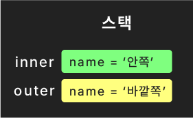

# 매개변수와 함수 활용

Date: 2026년 1월 4일
완료: No
1일후: 핵심요약+문제: No
7일 후: 퀴즈+문제: No
강의 넘버: 27~28

# JavaScript 함수 심화 - 매개변수와 함수 활용

## 📚 목차

1. [함수의 매개변수](https://claude.ai/chat/d5f0b0be-2aca-4f48-a05b-e3e6b9b033a0#1-%ED%95%A8%EC%88%98%EC%9D%98-%EB%A7%A4%EA%B0%9C%EB%B3%80%EC%88%98)
    - 1.1 [기본값 매개변수](https://claude.ai/chat/d5f0b0be-2aca-4f48-a05b-e3e6b9b033a0#11-%EA%B8%B0%EB%B3%B8%EA%B0%92-%EB%A7%A4%EA%B0%9C%EB%B3%80%EC%88%98)
    - 1.2 [arguments 객체](https://claude.ai/chat/d5f0b0be-2aca-4f48-a05b-e3e6b9b033a0#12-arguments-%EA%B0%9D%EC%B2%B4)
    - 1.3 [나머지 매개변수 (Rest Parameters)](https://claude.ai/chat/d5f0b0be-2aca-4f48-a05b-e3e6b9b033a0#13-%EB%82%98%EB%A8%B8%EC%A7%80-%EB%A7%A4%EA%B0%9C%EB%B3%80%EC%88%98-rest-parameters)
2. [함수 심화 개념](https://claude.ai/chat/d5f0b0be-2aca-4f48-a05b-e3e6b9b033a0#2-%ED%95%A8%EC%88%98-%EC%8B%AC%ED%99%94-%EA%B0%9C%EB%85%90)
    - 2.1 [중첩된 함수](https://claude.ai/chat/d5f0b0be-2aca-4f48-a05b-e3e6b9b033a0#21-%EC%A4%91%EC%B2%A9%EB%90%9C-%ED%95%A8%EC%88%98)
    - 2.2 [재귀 함수](https://claude.ai/chat/d5f0b0be-2aca-4f48-a05b-e3e6b9b033a0#22-%EC%9E%AC%EA%B7%80-%ED%95%A8%EC%88%98)
    - 2.3 [즉시 실행 함수 (IIFE)](https://claude.ai/chat/d5f0b0be-2aca-4f48-a05b-e3e6b9b033a0#23-%EC%A6%89%EC%8B%9C-%EC%8B%A4%ED%96%89-%ED%95%A8%EC%88%98-iife)
    - 2.4 [불변성 (Immutability)](https://claude.ai/chat/d5f0b0be-2aca-4f48-a05b-e3e6b9b033a0#24-%EB%B6%88%EB%B3%80%EC%84%B1-immutability)

---

## 1. 함수의 매개변수

### 📌 기본 개념

JavaScript에서 함수 호출 시 **정의된 매개변수 개수를 초과하는 인수를 전달해도 오류가 발생하지 않습니다.** 초과된 인수는 무시되며, 함수는 정상적으로 실행됩니다.

```jsx
function add(a, b) {
  return a + b;
}

console.log(add(1, 3));      // 4
console.log(add(1, 3, 5));   // 4 (5는 무시됨)
console.log(add(1, 3, 5, 7)); // 4 (5, 7은 무시됨)

```

---

### 1.1 기본값 매개변수

**출처:** [MDN - Default parameters](https://developer.mozilla.org/ko/docs/Web/JavaScript/Reference/Functions/Default_parameters)

### 개념 설명

기본값 매개변수(Default Parameter)는 함수 호출 시 **인수가 전달되지 않거나 `undefined`가 전달될 때 사용할 기본값을 매개변수에 지정**할 수 있는 ES6 문법입니다.

### 문법

```jsx
function 함수명(매개변수1 = 기본값1, 매개변수2 = 기본값2) {
  // 함수 본문
}

```

### 사용 상황

- 함수 호출 시 선택적 인수를 허용하고 싶을 때
- 매개변수가 누락되었을 때 안전한 기본값을 제공하고 싶을 때
- 함수 내부에서 매개변수 존재 여부를 확인하는 조건문을 줄이고 싶을 때

### 예시 코드

```jsx
function add(a = 2, b = 4) {
  console.log(`${a} + ${b}`);
  return a + b;
}

console.log(add());      // "2 + 4", 6
console.log(add(1));     // "1 + 4", 5
console.log(add(1, 3));  // "1 + 3", 4

```

---

### 1.2 arguments 객체

**출처:** [MDN - The arguments object](https://developer.mozilla.org/ko/docs/Web/JavaScript/Reference/Functions/arguments)

### 개념 설명

`arguments`는 함수 내에서 사용 가능한 **지역 변수**로, 함수 호출 시 전달된 **모든 인수들을 배열 형태로 담고 있는 유사 배열 객체(Array-like Object)**입니다. 실제 배열은 아니지만 배열처럼 인덱스 접근과 반복이 가능합니다.

### 특징

- `typeof arguments`의 결과는 `'object'`입니다
- 배열 메서드(`map`, `filter` 등)는 직접 사용할 수 없습니다
- `for...of` 루프 사용이 가능합니다 (iterable이기 때문)
- **화살표 함수에서는 `arguments` 사용 불가**합니다

### 사용 상황

- 함수 정의 시 매개변수 개수를 정하지 않고, 가변 개수의 인수를 받아야 할 때
- 전달된 모든 인수를 순회하며 처리해야 할 때
- 레거시 코드 유지보수 시 (현재는 Rest Parameters 권장)

### 예시 코드

**기본 사용법:**

```jsx
function add(a, b) {
  console.log('1.', arguments);          // [Arguments] { '0': 1, '1': 3, '2': 5, '3': 7 }
  console.log('2.', arguments[0]);       // 1
  console.log('3.', typeof arguments);   // object
  return a + b;
}

console.log('4.', add(1, 3, 5, 7));      // 4

```

**반복문 활용:**

```jsx
function add(a, b) {
  for (const arg of arguments) {
    console.log(arg);  // 1, 3, 5, 7 순서로 출력
  }
  return a + b;
}

console.log(add(1, 3, 5, 7));  // 4

```

**평균 계산 함수:**

```jsx
function getAverage() {
  let result = 0;
  for (const num of arguments) {
    result += num;
  }
  return result / arguments.length;
}

console.log(getAverage(1, 4, 7));           // 4
console.log(getAverage(24, 31, 52, 80));    // 46.75

```

**타입 검증을 추가한 안전한 버전:**

```jsx
function getAverage() {
  let result = 0, count = 0;
  for (const num of arguments) {
    if (typeof num !== 'number') continue;
    result += num;
    count++;
  }
  return result / count;
}

console.log(getAverage(2, '가', 8, true, 5));  // 5 (2, 8, 5만 계산)

```

**함수를 조합하는 고차 함수:**

```jsx
const add = (a, b) => a + b;
const sub = (a, b) => a - b;
const mul = (a, b) => a * b;
const div = (a, b) => a / b;

function combineArms() {
  return (x, y) => {
    let result = x;
    for (const arm of arguments) {
      if (typeof arm !== 'function') continue;
      result = arm(result, y);
    }
    return result;
  }
}

const add_mul = combineArms(add, mul, 1, true);
const add_mul_sub = combineArms(add, mul, sub);

console.log(add_mul(8, 3));      // 33 ((8+3)*3)
console.log(add_mul_sub(8, 3));  // 30 (((8+3)*3)-3)

```

---

### 1.3 나머지 매개변수 (Rest Parameters)

**출처:** [MDN - Rest parameters](https://developer.mozilla.org/ko/docs/Web/JavaScript/Reference/Functions/rest_parameters)

### 개념 설명

나머지 매개변수(Rest Parameters)는 **함수의 마지막 매개변수 앞에 `...`을 붙여** 정해지지 않은 수의 인수를 **실제 배열로** 받을 수 있는 ES6 문법입니다. `arguments` 객체와 달리 진짜 배열이므로 모든 배열 메서드를 사용할 수 있습니다.

### 문법

```jsx
function 함수명(매개변수1, 매개변수2, ...나머지변수명) {
  // 나머지변수명은 실제 배열
}

```

### 특징

- 반드시 **마지막 매개변수로만 사용 가능**합니다
- 실제 배열이므로 `map`, `filter`, `reduce` 등 모든 배열 메서드 사용 가능
- 화살표 함수에서도 사용 가능합니다
- `arguments` 객체보다 명확하고 현대적인 방식입니다

### 사용 상황

- 특정 매개변수들 이후에 가변 개수의 인수를 받아야 할 때
- 배열 메서드를 활용한 데이터 처리가 필요할 때
- 코드의 가독성과 명확성을 높이고 싶을 때

### 예시 코드

**기본 사용법:**

```jsx
function classIntro(classNo, teacher, ...children) {
  console.log('1.', children);    // ['영희', '철수', '보라'] - 실제 배열
  console.log('2.', arguments);   // [Arguments] 전체 인수

  let childrenStr = '';
  for (const child of children) {
    if (childrenStr) childrenStr += ', ';
    childrenStr += child;
  }
  return `${classNo}반의 선생님은 ${teacher}, 학생들은 ${childrenStr}입니다.`;
}

console.log(classIntro(3, '김민지', '영희', '철수', '보라'));
// "3반의 선생님은 김민지, 학생들은 영희, 철수, 보라입니다."

```

**함수 조합 개선 버전:**

```jsx
const add = (a, b) => a + b;
const sub = (a, b) => a - b;
const mul = (a, b) => a * b;
const div = (a, b) => a / b;

function doMultiArms(x, y, ...arms) {
  let result = x;
  for (const arm of arms) {
    if (typeof arm !== 'function') continue;
    result = arm(result, y);
  }
  return result;
}

console.log(doMultiArms(8, 3, add, mul, 1, true));  // 33
console.log(doMultiArms(8, 3, add, mul, sub));      // 30
console.log(doMultiArms(8, 3, add, mul, sub, div)); // 10
console.log(doMultiArms(8, 3, add, mul, sub, div, (x, y) => x ** y));  // 1000

```

---

## 2. 함수 심화 개념

### 2.1 중첩된 함수

### 개념 설명

중첩된 함수(Nested Function)는 **함수 내부에 다른 함수를 정의**하는 것을 말합니다. 내부 함수는 외부 함수의 변수에 접근할 수 있으며, 외부에서는 내부 함수에 직접 접근할 수 없습니다.

### 특징

- 내부 함수는 외부 함수의 스코프에 접근 가능
- 코드의 캡슐화와 정보 은닉에 유용
- 실행 스택에서 외부 함수 → 내부 함수 순으로 쌓임

### 사용 상황

- 함수 내부에서만 사용되는 헬퍼 함수를 정의할 때
- 클로저를 구현할 때
- 코드의 모듈성을 높이고 싶을 때

### 예시 코드

**기본 중첩 함수:**

```jsx
function outer() {
  const name = '바깥쪽'
  console.log(name, '함수');

  function inner() {
    const name = '안쪽'
    console.log(name, '함수');
  }
  inner();
}

outer();
// "바깥쪽 함수"
// "안쪽 함수"

```

**실행 스택 구조:**



**연산 함수 조합:**

```jsx
function addMulSub(x, y) {
  const add = (a, b) => a + b;
  const sub = (a, b) => a - b;
  const mul = (a, b) => a * b;

  return sub(mul(add(x, y), y), y);
}

console.log(addMulSub(8, 3));  // 30
// 계산 순서: (8+3) = 11 → 11*3 = 33 → 33-3 = 30

```

---

### 2.2 재귀 함수

### 개념 설명

재귀 함수(Recursive Function)는 **함수가 자기 자신을 호출하는 함수**입니다. 종료 조건(Base Case)이 반드시 필요하며, 이를 충족하지 못하면 무한 루프에 빠져 스택 오버플로우(Stack Overflow) 오류가 발생합니다.

### 구조

```jsx
function recursive(parameter) {
  // 종료 조건 (Base Case)
  if (조건) {
    return 값;
  }
  // 재귀 호출 (Recursive Case)
  return recursive(새로운값);
}

```

### 사용 상황

- 문제를 동일한 구조의 더 작은 문제로 분할할 수 있을 때
- 트리, 그래프 구조를 탐색할 때
- 팩토리얼, 피보나치 수열 등 수학적 계산
- 반복문으로 구현하기 복잡한 로직을 단순화할 때

### 예시 코드

**기본 재귀 함수:**

```jsx
function upto5(x) {
  console.log(x);
  if (x < 5) {
    upto5(x + 1);  // 재귀 호출
  } else {
    console.log('- - -');
  }
}

upto5(1);  // 1, 2, 3, 4, 5, - - -
upto5(3);  // 3, 4, 5, - - -
upto5(7);  // 7, - - -
```


**팩토리얼 계산:**

```jsx
function fact(x) {
  return x === 0 ? 1 : x * fact(x - 1);
}

console.log(fact(1));  // 1
console.log(fact(2));  // 2
console.log(fact(3));  // 6
console.log(fact(4));  // 24

// 계산 과정 (fact(4)):
// 4 * fact(3)
// 4 * 3 * fact(2)
// 4 * 3 * 2 * fact(1)
// 4 * 3 * 2 * 1 * fact(0)
// 4 * 3 * 2 * 1 * 1 = 24
```


---

### 2.3 즉시 실행 함수 (IIFE)

**출처:** [MDN - IIFE](https://developer.mozilla.org/ko/docs/Glossary/IIFE)

### 개념 설명

즉시 실행 함수(IIFE, Immediately Invoked Function Expression)는 **정의와 동시에 즉시 실행되는 함수**입니다. 함수를 괄호로 감싸고 뒤에 `()`를 붙여 실행합니다. 오늘날에는 블록 스코프와 모듈 시스템으로 대체되어 잘 사용되지 않지만, 레거시 코드 분석을 위해 알아둘 필요가 있습니다.

### 문법

```jsx
(function() {
  // 코드
})();

// 또는 화살표 함수
(() => {
  // 코드
})();

```

### 사용 목적 (과거)

- 전역 스코프 오염 방지
- 변수명/상수명 충돌 방지
- 일회성 초기화 코드 실행
- `var`의 함수 스코프 한계를 극복

### 예시 코드

**기본 IIFE:**

```jsx
(function() {
  console.log('IIFE');
})();
// 즉시 "IIFE" 출력

```

**전역 변수 오염 방지:**

```jsx
const initialMessage = (function() {
  var month = 8;
  var day = 15;
  var temps = [28, 27, 27, 30, 32, 32, 30, 28];
  var avgTemp = 0;
  for (const temp of temps) {
    avgTemp += temp;
  }
  avgTemp /= temps.length;

  return `${month}월 ${day}일 평균기온은 섭씨 ${avgTemp}도입니다.`;
})();

console.log(initialMessage);  // "8월 15일 평균기온은 섭씨 29도입니다."
console.log(month);  // ReferenceError: month is not defined

```

**현대적 대체 방법 (블록 스코프):**

```jsx
let initialMessage;

{
  const month = 8;
  const day = 15;
  const temps = [28, 27, 27, 30, 32, 32, 30, 28];
  let avgTemp = 0;
  for (const temp of temps) {
    avgTemp += temp;
  }
  avgTemp /= temps.length;

  initialMessage = `${month}월 ${day}일 평균기온은 섭씨 ${avgTemp}도입니다.`;
}

console.log(initialMessage);  // 정상 출력
console.log(month);  // ReferenceError: month is not defined

```

---

### 2.4 불변성 (Immutability)

### 개념 설명

불변성(Immutability)은 **데이터가 생성된 후 변경되지 않는 성질**을 의미합니다. JavaScript에서는 원시 타입(Primitive Type)과 참조 타입(Reference Type)의 불변성이 다르게 동작합니다.

### 원시 타입 vs 참조 타입

**원시 타입 (Primitive Type):**

- `number`, `string`, `boolean`, `null`, `undefined`, `symbol`, `bigint`
- 함수의 인자로 전달될 때 **값이 복사**됨
- 함수 내부에서 변경해도 원본에 영향 없음

**참조 타입 (Reference Type):**

- `object`, `array`, `function`
- 함수의 인자로 전달될 때 **참조(주소)가 복사**됨
- 함수 내부에서 요소를 변경하면 원본도 변경됨

### 사용 상황

- 함수형 프로그래밍 구현 시
- 예측 가능하고 안전한 코드 작성 시
- 부수 효과(Side Effect)를 최소화하고 싶을 때

### 예시 코드

```jsx
let x = 1;
let y = {
  name: '홍길동',
  age: 15
};
let z = [1, 2, 3];

function changeValue(a, b, c) {
  a++;              // 원시 타입: 복사본 변경
  b.name = '전우치';  // 참조 타입: 원본 변경
  b.age++;          // 참조 타입: 원본 변경
  c[0]++;           // 참조 타입: 원본 변경

  console.log(a, b, c);
  // 2, { name: '전우치', age: 16 }, [2, 2, 3]
}

changeValue(x, y, z);

console.log(x, y, z);
// 1, { name: '전우치', age: 16 }, [2, 2, 3]
// x는 변경 안됨, y와 z는 변경됨

```

### 중요 원칙

> ⭐️ 함수에 주어진 인자를 변경하는 것은 좋지 않습니다.
> 
> 
> ⚠️ **외부 환경을 변경하는 함수는 위험합니다!**
> 
> **이상적인 함수:** 받은 값들만 처리하여 새 값을 반환
> 

**나쁜 예:**

```jsx
function badFunction(arr) {
  arr.push(4);  // 원본 배열 변경 (부수 효과)
  return arr;
}

```

**좋은 예:**

```jsx
function goodFunction(arr) {
  return [...arr, 4];  // 새 배열 반환 (불변성 유지)
}

```

---

## 🎯 최종 핵심 요약

### 매개변수 관련

1. **기본값 매개변수**: 인수가 없을 때 기본값 제공 (`function fn(a = 1) {}`)
2. **arguments**: 함수 내 모든 인수를 담은 유사 배열 객체 (화살표 함수 불가)
3. **Rest Parameters**: 가변 인수를 실제 배열로 받음 (`function fn(...args) {}`)

### 함수 심화 개념

1. **중첩 함수**: 함수 내부에 함수 정의, 스코프 접근과 캡슐화에 유용
2. **재귀 함수**: 자기 자신을 호출, 종료 조건 필수
3. **IIFE**: 즉시 실행 함수, 현재는 블록/모듈로 대체됨
4. **불변성**: 원시 타입은 불변, 참조 타입은 가변 → 함수는 인자 변경 금지, 새 값 반환 권장

### 핵심 기억 사항

- 초과 인수는 무시됨 (오류 없음)
- `arguments`는 유사 배열, Rest Parameters는 진짜 배열
- 화살표 함수는 `arguments` 사용 불가
- 함수는 외부 환경을 변경하지 않고, 받은 값만 처리하여 새 값을 반환하는 것이 이상적

---

## 📝 복습 퀴즈

### 퀴즈 1: 기본값 매개변수

다음 코드의 실행 결과는 무엇인가요?

```jsx
function greet(name = 'Guest', greeting = 'Hello') {
  return `${greeting}, ${name}!`;
}

console.log(greet());
console.log(greet('Alice'));
console.log(greet('Bob', 'Hi'));

```

**선택지:**

A) `Hello, Guest!` / `Hello, Alice!` / `Hi, Bob!`

B) `undefined, undefined!` / `Hello, Alice!` / `Hi, Bob!`

C) `Hello, !` / `Hello, Alice!` / `Hi, Bob!`

D) `Guest, Hello!` / `Alice, Hello!` / `Bob, Hi!`

**정답: A**

해설: 기본값 매개변수는 인수가 전달되지 않았을 때 지정된 기본값을 사용합니다. 첫 번째 호출에서는 두 매개변수 모두 기본값이 사용되고, 두 번째 호출에서는 `name`만 전달되어 `greeting`은 기본값이 사용되며, 세 번째 호출에서는 두 인수 모두 전달되어 기본값이 사용되지 않습니다.

---

### 퀴즈 2: arguments 객체

다음 중 `arguments` 객체에 대한 설명으로 올바르지 않은 것은?

A) `arguments`는 함수 내에서 사용 가능한 지역 변수이다

B) `arguments`는 실제 배열이므로 `map`, `filter` 등의 배열 메서드를 사용할 수 있다

C) `arguments`는 함수에 전달된 모든 인수를 담고 있다

D) 화살표 함수에서는 `arguments`를 사용할 수 없다

**정답: B**

해설: `arguments`는 유사 배열 객체(Array-like Object)이지 실제 배열이 아닙니다. 따라서 `map`, `filter` 등의 배열 메서드를 직접 사용할 수 없습니다. 인덱스 접근과 `for...of` 루프는 가능하지만, 배열 메서드를 사용하려면 `Array.from(arguments)` 또는 스프레드 연산자 `[...arguments]`로 실제 배열로 변환해야 합니다.

---

### 퀴즈 3: Rest Parameters

다음 코드의 실행 결과는 무엇인가요?

```jsx
function sum(a, b, ...rest) {
  console.log(Array.isArray(rest));
  return a + b + rest.length;
}

console.log(sum(1, 2, 3, 4, 5));

```

**선택지:**

A) `false` / `3`

B) `true` / `6`

C) `true` / `15`

D) `false` / `15`

**정답: B**

해설: Rest Parameters(`...rest`)는 실제 배열이므로 `Array.isArray(rest)`는 `true`를 반환합니다. 함수 호출 시 `a=1`, `b=2`가 할당되고, 나머지 인수 `[3, 4, 5]`가 `rest` 배열에 담깁니다. 따라서 `1 + 2 + 3` (rest.length)의 결과인 `6`이 반환됩니다.

---

### 퀴즈 4: 재귀 함수

다음 재귀 함수의 `countdown(3)` 실행 결과는 무엇인가요?

```jsx
function countdown(n) {
  if (n <= 0) {
    return 'Done!';
  }
  console.log(n);
  return countdown(n - 1);
}

```

**선택지:**

A) `3` / `2` / `1` / `Done!`

B) `3` / `2` / `1` / `0` / `Done!`

C) `Done!`

D) `3` / `Done!`

**정답: A**

해설: 재귀 함수는 `n=3`일 때 3을 출력하고 `countdown(2)`를 호출, `n=2`일 때 2를 출력하고 `countdown(1)`을 호출, `n=1`일 때 1을 출력하고 `countdown(0)`을 호출합니다. `n=0`일 때는 종료 조건(`n <= 0`)에 도달하여 `'Done!'`을 반환하고 재귀가 종료됩니다.

---

### 퀴즈 5: 불변성

다음 코드 실행 후 각 변수의 값은 무엇인가요?

```jsx
let num = 10;
let obj = { value: 10 };

function modify(a, b) {
  a = 20;
  b.value = 20;
}

modify(num, obj);
console.log(num, obj.value);

```

**선택지:**

A) `10` / `10`

B) `20` / `20`

C) `10` / `20`

D) `20` / `10`

**정답: C**

해설: 원시 타입인 `num`은 함수에 값이 복사되어 전달되므로, 함수 내부에서 변경해도 원본에 영향을 주지 않습니다. 따라서 `num`은 여전히 `10`입니다. 반면 참조 타입인 `obj`는 참조(주소)가 복사되어 전달되므로, 함수 내부에서 객체의 속성을 변경하면 원본도 변경됩니다. 따라서 `obj.value`는 `20`으로 변경됩니다.

---

## 💻 연습문제

### 문제 1: 기본값 매개변수 활용

**문제:**

사용자 정보를 출력하는 함수를 작성하세요. 이름과 나이를 매개변수로 받으며, 나이가 제공되지 않으면 '미공개'로 표시되어야 합니다.

**기본 코드:**

```jsx
function printUserInfo(name, age) {
  // 여기에 코드를 작성하세요

}

// 테스트
console.log(printUserInfo('김철수', 25));
console.log(printUserInfo('이영희'));

```

**정답:**

```jsx
function printUserInfo(name, age = '미공개') {
  return `이름: ${name}, 나이: ${age}`;
}

// 테스트
console.log(printUserInfo('김철수', 25));  // "이름: 김철수, 나이: 25"
console.log(printUserInfo('이영희'));       // "이름: 이영희, 나이: 미공개"

```

**풀이:**

기본값 매개변수를 사용하여 `age` 매개변수에 기본값 `'미공개'`를 할당했습니다. 함수 호출 시 `age`가 전달되지 않으면 자동으로 기본값이 사용되어 '미공개'가 출력됩니다.

**해설:**

이 문제는 기본값 매개변수의 실용적인 활용 예시입니다. 선택적 정보를 다룰 때 기본값을 제공하면 함수 내부에서 별도의 조건문 없이도 안전하게 처리할 수 있어 코드가 간결해집니다.

---

### 문제 2: Rest Parameters로 최댓값 찾기

**문제:**

가변 개수의 숫자 인수를 받아 그 중 최댓값을 반환하는 함수를 작성하세요. Rest Parameters를 사용하여 구현해야 합니다.

**기본 코드:**

```jsx
function findMax(/* 여기에 매개변수를 작성하세요 */) {
  // 여기에 코드를 작성하세요

}

// 테스트
console.log(findMax(1, 5, 3, 9, 2));     // 9
console.log(findMax(10, 20, 15));        // 20
console.log(findMax(7));                 // 7

```

**정답:**

```jsx
function findMax(...numbers) {
  if (numbers.length === 0) return undefined;

  let max = numbers[0];
  for (const num of numbers) {
    if (num > max) {
      max = num;
    }
  }
  return max;
}

// 또는 배열 메서드 활용
function findMax(...numbers) {
  if (numbers.length === 0) return undefined;
  return Math.max(...numbers);
}

// 테스트
console.log(findMax(1, 5, 3, 9, 2));     // 9
console.log(findMax(10, 20, 15));        // 20
console.log(findMax(7));                 // 7

```

**풀이:**

Rest Parameters(`...numbers`)를 사용하여 모든 인수를 배열로 받습니다. 첫 번째 방법은 반복문으로 직접 최댓값을 찾고, 두 번째 방법은 `Math.max()` 메서드를 활용합니다. Rest Parameters가 실제 배열이므로 스프레드 연산자로 다시 풀어서 `Math.max()`에 전달할 수 있습니다.

**해설:**

Rest Parameters는 실제 배열이므로 모든 배열 메서드를 사용할 수 있습니다. 이를 통해 가변 개수의 인수를 받는 함수를 간결하고 명확하게 작성할 수 있으며, `arguments` 객체보다 현대적이고 권장되는 방식입니다.

---

### 문제 3: 재귀 함수로 배열 합계 구하기

**문제:**

재귀 함수를 사용하여 배열의 모든 요소의 합계를 구하는 함수를 작성하세요.

**기본 코드:**

```jsx
function sumArray(arr) {
  // 여기에 재귀 함수 코드를 작성하세요

}

// 테스트
console.log(sumArray([1, 2, 3, 4, 5]));  // 15
console.log(sumArray([10, 20, 30]));     // 60
console.log(sumArray([5]));              // 5
console.log(sumArray([]));               // 0

```

**정답:**

```jsx
function sumArray(arr) {
  // 종료 조건: 배열이 비어있으면 0 반환
  if (arr.length === 0) {
    return 0;
  }

  // 재귀 호출: 첫 번째 요소 + 나머지 배열의 합계
  return arr[0] + sumArray(arr.slice(1));
}

// 테스트
console.log(sumArray([1, 2, 3, 4, 5]));  // 15
console.log(sumArray([10, 20, 30]));     // 60
console.log(sumArray([5]));              // 5
console.log(sumArray([]));               // 0

```

**풀이:**

재귀 함수의 핵심은 종료 조건과 재귀 호출입니다. 배열이 비어있으면 0을 반환하고(종료 조건), 그렇지 않으면 첫 번째 요소와 나머지 배열의 합계를 더합니다(재귀 호출). `arr.slice(1)`은 첫 번째 요소를 제외한 새 배열을 반환하므로, 재귀 호출마다 배열의 크기가 줄어들어 종료 조건에 도달합니다.

**해설:**

재귀 함수는 문제를 더 작은 동일한 구조의 문제로 나누어 해결합니다. 이 경우 "배열의 합 = 첫 요소 + 나머지 배열의 합"으로 문제를 분할했습니다. 재귀는 우아하지만 큰 배열에서는 스택 오버플로우 위험이 있으므로, 실무에서는 반복문이나 `reduce()` 메서드를 사용하는 것이 일반적으로 더 안전합니다.

---

### 문제 4: 불변성을 지키는 배열 업데이트

**문제:**

배열과 인덱스, 새로운 값을 받아서, 원본 배열을 변경하지 않고 해당 인덱스의 값만 변경된 새로운 배열을 반환하는 함수를 작성하세요.

**기본 코드:**

```jsx
function updateArray(arr, index, newValue) {
  // 여기에 코드를 작성하세요 (원본 배열을 변경하지 마세요)

}

// 테스트
const original = [1, 2, 3, 4, 5];
const updated = updateArray(original, 2, 99);

console.log(original);  // [1, 2, 3, 4, 5] - 원본 유지
console.log(updated);   // [1, 2, 99, 4, 5] - 새 배열

```

**정답:**

```jsx
function updateArray(arr, index, newValue) {
  // 방법 1: 스프레드 연산자와 slice 활용
  return [...arr.slice(0, index), newValue, ...arr.slice(index + 1)];

  // 방법 2: map 메서드 활용
  // return arr.map((value, i) => i === index ? newValue : value);

  // 방법 3: 전개 연산자로 복사 후 변경
  // const newArr = [...arr];
  // newArr[index] = newValue;
  // return newArr;
}

// 테스트
const original = [1, 2, 3, 4, 5];
const updated = updateArray(original, 2, 99);

console.log(original);  // [1, 2, 3, 4, 5]
console.log(updated);   // [1, 2, 99, 4, 5]

```

**풀이:**

세 가지 방법 모두 원본 배열을 변경하지 않고 새 배열을 반환합니다. 방법 1은 `slice()`로 배열을 나누고 스프레드 연산자로 합칩니다. 방법 2는 `map()`으로 각 요소를 순회하며 해당 인덱스만 새 값으로 교체합니다. 방법 3은 스프레드 연산자로 배열을 복사한 후 특정 인덱스만 변경합니다.

**해설:**

불변성을 지키는 것은 함수형 프로그래밍의 핵심 원칙입니다. 원본 데이터를 변경하지 않으면 예측 가능한 코드를 작성할 수 있고, 디버깅이 쉬워지며, React와 같은 프레임워크에서 상태 변경을 안전하게 추적할 수 있습니다. 원본을 변경하지 않고 새로운 값을 반환하는 습관을 들이는 것이 중요합니다.

---

### 문제 5: 중첩 함수로 클로저 구현

**문제:**

카운터 함수를 만들어보세요. `createCounter()` 함수는 호출될 때마다 1씩 증가하는 카운트 값을 반환하는 함수를 반환해야 합니다. 각 카운터는 독립적으로 동작해야 합니다.

**기본 코드:**

```jsx
function createCounter() {
  // 여기에 코드를 작성하세요

}

// 테스트
const counter1 = createCounter();
const counter2 = createCounter();

console.log(counter1());  // 1
console.log(counter1());  // 2
console.log(counter1());  // 3

console.log(counter2());  // 1
console.log(counter2());  // 2

console.log(counter1());  // 4

```

**정답:**

```jsx
function createCounter() {
  let count = 0;  // 클로저로 보호되는 private 변수

  return function() {
    count++;
    return count;
  };
}

// 테스트
const counter1 = createCounter();
const counter2 = createCounter();

console.log(counter1());  // 1
console.log(counter1());  // 2
console.log(counter1());  // 3

console.log(counter2());  // 1
console.log(counter2());  // 2

console.log(counter1());  // 4

```

**풀이:**

`createCounter()` 함수 내부에 `count` 변수를 선언하고, 이를 증가시켜 반환하는 내부 함수를 반환합니다. 반환된 함수는 외부 함수의 `count` 변수에 계속 접근할 수 있습니다(클로저). 각 `createCounter()` 호출은 독립적인 `count` 변수를 생성하므로, `counter1`과 `counter2`는 서로 독립적으로 동작합니다.

**해설:**

이것이 클로저(Closure)의 대표적인 예시입니다. 내부 함수는 외부 함수의 변수를 "기억"하며, 외부 함수가 종료된 후에도 그 변수에 접근할 수 있습니다. 클로저를 활용하면 private 변수를 만들어 데이터를 보호하고, 상태를 유지하는 함수를 만들 수 있습니다. 이는 JavaScript의 강력한 특징 중 하나이며, 모듈 패턴, 콜백, 이벤트 핸들러 등에서 널리 사용됩니다.

---

## ✅ 학습 체크리스트

### 매개변수 관련

- [ ]  함수에 정의된 매개변수보다 많은 인수를 전달해도 오류가 발생하지 않는다는 것을 이해했는가?
- [ ]  기본값 매개변수의 문법과 사용 목적을 이해했는가?
- [ ]  `arguments` 객체가 유사 배열 객체임을 이해하고, 배열 메서드를 직접 사용할 수 없다는 것을 알고 있는가?
- [ ]  화살표 함수에서는 `arguments`를 사용할 수 없다는 것을 알고 있는가?
- [ ]  Rest Parameters가 실제 배열이며, `arguments`보다 권장되는 방식임을 이해했는가?
- [ ]  Rest Parameters는 마지막 매개변수로만 사용할 수 있다는 것을 알고 있는가?

### 함수 심화 개념

- [ ]  중첩 함수의 개념과 스코프 접근 방식을 이해했는가?
- [ ]  재귀 함수의 구조(종료 조건 + 재귀 호출)를 이해했는가?
- [ ]  재귀 함수에서 종료 조건이 없으면 스택 오버플로우가 발생한다는 것을 알고 있는가?
- [ ]  IIFE의 문법과 과거 사용 목적을 이해했는가?
- [ ]  IIFE가 현재는 블록 스코프와 모듈로 대체되었음을 알고 있는가?
- [ ]  원시 타입과 참조 타입의 불변성 차이를 이해했는가?
- [ ]  함수가 인자를 변경하는 것이 위험하며, 새 값을 반환하는 것이 이상적이라는 것을 이해했는가?

### 실전 적용

- [ ]  가변 인수를 받는 함수를 Rest Parameters로 구현할 수 있는가?
- [ ]  재귀 함수를 사용하여 간단한 문제를 해결할 수 있는가?
- [ ]  원본 데이터를 변경하지 않고 새로운 값을 반환하는 함수를 작성할 수 있는가?
- [ ]  클로저를 활용하여 상태를 유지하는 함수를 만들 수 있는가?

---